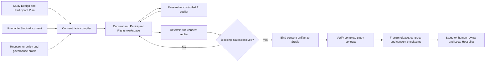

# Stage 3 — Consent and Participant Rights Architecture

Status: Phases 0–10 implemented; contract, pilot-candidate, and Stage 4 integration remain proposed

Scope: a new Stage 03 consent-authoring step, its AI copilot, deterministic
verification, runnable-study integration, release identity, and Stage 04
handoff

Product code changed by this proposal: the Phase 5–10 consent authoring,
source-reconciliation, specialized-family, review, export, and bounded AI
copilot slices are implemented, together with the adult English participant
runtime, receipt, refusal, and withdrawal boundary

Related proposal:
[Stage 3 verified-contract and pilot-candidate architecture](./stage-3-contract-and-pilot-release-architecture.md)

Generative-builder companion:
[Stage 3 generative study-builder and dependency architecture](./stage-3-generative-study-builder-architecture.md)

Research-backed implementation phases:
[Stage 3 study-builder and consent implementation plan](./stage-3-study-builder-and-consent-implementation-plan.md)

Visual review board:
[Cerise Scholar Stage 3 Architecture](https://www.figma.com/board/PjKGE6Rt5mivhrKs7wq9ub)

## Recommendation

Add **Design Consent and Participant Rights** as the new visible **Stage 03,
Step 05**, after **Build Study** and before **Verify Data and Analysis
Contract**.

The revised visible order should be:

| Visible step                             | Responsibility                                                                                                 | Persisted ID       |
| ---------------------------------------- | -------------------------------------------------------------------------------------------------------------- | ------------------ |
| 01 Select Design                         | Choose and justify the study design                                                                            | `stage-03-step-01` |
| 02 Map Measures                          | Define research questions, constructs, and evidence                                                            | `stage-03-step-02` |
| 03 Plan Participants                     | Define population, sampling, assignment, and accessibility                                                     | `stage-03-step-03` |
| 04 Build Study                           | Implement the participant procedure and data-producing screens                                                 | `stage-03-step-04` |
| 05 Design Consent and Participant Rights | Compile study facts, author forms, review participant rights, and bind the reviewed draft to the runnable flow | `stage-03-consent` |
| 06 Verify Data and Analysis Contract     | Reconcile intent, implementation, consent, variables, and analysis commitments                                 | `stage-03-step-05` |
| 07 Create Pilot Candidate                | Rehearse, preflight, freeze, checksum, version, and export                                                     | `stage-03-step-06` |

The current Step 05 and Step 06 persisted IDs remain unchanged. Their visible
numbers move to 06 and 07 because `ResearchPathStep.id` is already independent
from its derived display number. The inserted step receives a new explicit ID,
and the two existing downstream steps must also be declared with their existing
explicit IDs in configuration so array insertion cannot rename their drafts.

## Why this order is strongest

### Why consent should not come before Build Study

Before the runnable procedure exists, Cerise does not yet know the exact:

- participant tasks and sequence;
- time and response burden;
- variables and event logs collected;
- audio, video, image, fullscreen, focus, and device behavior;
- randomization and condition assignment;
- local storage and withdrawal behavior;
- debrief or deception path;
- pilot and production execution mode.

A form drafted earlier would either be generic or make claims that later become
false. The consent compiler should read the implemented Studio document and
turn those facts into explicit researcher decisions.

### Why consent should not come after contract verification

Consent is part of the study contract. The verifier must be able to answer:

- Does the form describe what the runtime actually does?
- Does every recording or sensitive-data path have the required separate
  decision?
- Does declining participation end the flow without retaining study data?
- Does the withdrawal wording match the implemented deletion boundary?
- Are data retention, sharing, access, and analysis claims consistent with the
  frozen package?

Those questions cannot be verified if the consent artifact does not yet exist.

### Why consent is not merely another Studio screen

The current Experimental Studio `consent` block stores a heading, prompt, two
choices, and a response variable. That is suitable for a runtime decision but
too weak for versioned consent authoring, audience variants, institutional
review, data-practice reconciliation, and immutable provenance.

The new step owns the consent protocol and form artifacts. The Studio owns
where and how the frozen artifact is presented in the participant flow.

## Plain-language Stage 3 workflow

The seven-step workflow can be understood as seven questions:

1. **Select Design:** What kind of study are we conducting, and why?
2. **Map Measures:** What are we trying to learn, and what evidence answers
   each question?
3. **Plan Participants:** Who or what provides the evidence, and how will they
   be recruited, included, and supported?
4. **Build Study:** What will participants actually see and do, and what data
   will the runnable study produce?
5. **Design Consent and Participant Rights:** What must participants know and
   decide before that procedure may begin?
6. **Verify Contract:** Do the design, runnable study, consent, data dictionary,
   and planned interpretation all describe the same study?
7. **Create Pilot Candidate:** Can that exact coherent version be frozen and
   sent to governance review and pilot testing?

After Stage 03, Stage 04 records ethics/risk review, expert feedback, pilot
authorization and results, revisions, and final collection approval against
the exact release and consent checksums. The Local Research Host remains the
source of truth for operational pilot evidence and production readiness.

## Product boundary

Cerise should describe this feature as a **consent-authoring and consistency
assistant**, not a consent generator, legal checker, IRB, ethics board, or
compliance certification service.

Informed consent is a process rather than merely a document. For example, U.S.
HHS guidance emphasizes understandable information, time to decide, voluntary
choice, and minimizing coercion or undue influence. Applicable requirements
vary by jurisdiction, institution, population, and study. Cerise therefore
provides structured coverage and consistency checks while requiring the
researcher to select the applicable governance profile and obtain the required
human review.

Reference posture:

- [HHS OHRP informed-consent FAQs](https://www.hhs.gov/ohrp/regulations-and-policy/guidance/faq/informed-consent/index.html)
- [FDA and OHRP electronic informed-consent guidance](https://www.fda.gov/regulatory-information/search-fda-guidance-documents/use-electronic-informed-consent-clinical-investigations-questions-and-answers)
- [W3C Web Content Accessibility Guidelines 2.2](https://www.w3.org/TR/WCAG22/)

These references inform safe defaults. They are not a universal legal ruleset,
and Cerise must not infer that a study is subject to a particular regulation.

## Architecture overview



## Core domain model

### Persisted draft versus compiled view

Persist only researcher decisions and source identities. Recompute derived
facts, drift, issues, and readiness whenever the document loads or an upstream
source changes.

```ts
type ConsentProtocolDraft = {
  schemaVersion: 1;
  projectId: string;
  governanceProfile: ConsentGovernanceProfile;
  participantGroups: ConsentParticipantGroup[];
  forms: ConsentFormDraft[];
  dataPractices: ConsentDataPractices;
  withdrawalPlan: ConsentWithdrawalPlan;
  compensationPlan: ConsentCompensationPlan;
  reviewedSource: ConsentSourceFingerprint | null;
  researcherNotes: string;
  updatedAt: string;
};

type CompiledConsentProtocol = {
  draft: ConsentProtocolDraft;
  source: ConsentSourceFingerprint;
  derivedStudyFacts: ConsentStudyFact[];
  forms: CompiledConsentForm[];
  changeSummary: ConsentChangeSummary;
  readiness: ConsentReadiness;
};
```

No stored `ready` flag is trusted. The compiler owns readiness.

### Governance profile

```ts
type ConsentGovernanceProfile = {
  countryOrRegion: string;
  institutionOrSponsor: string;
  reviewPath:
    | "institutional-review"
    | "supervisor-review"
    | "community-review"
    | "documented-exemption"
    | "documented-waiver"
    | "not-yet-determined";
  governingTemplateName: string;
  governingTemplateVersion: string;
  approvalRequiredBeforePilot: "yes" | "no" | "unknown";
  researcherConfirmedApplicability: boolean;
};
```

Cerise never selects the legal jurisdiction, review category, exemption,
waiver, or approval requirement on the researcher's behalf. `unknown` remains
blocking where a decision is necessary.

### Participant groups and form variants

One study may require multiple related artifacts:

- adult participant consent;
- parental or guardian permission;
- age-appropriate assent;
- legally authorized representative consent;
- optional audio recording consent;
- optional video recording consent;
- optional future-use or recontact choice;
- translated or accessible presentation variants.

These variants share study facts but preserve separate wording, decisions,
audiences, languages, and review states.

The first executable release should support adult self-consent and separate
optional recording choices. It may author, version, export, and freeze guardian,
assent, and legally authorized representative forms, but it must not claim to
collect valid multi-party permission until identity, authorization ordering,
signature/documentation, and institutional rules have their own approved
architecture. Authoring support and legally effective execution are separate
capabilities.

```ts
type ConsentFormDraft = {
  id: string;
  audience:
    | "adult-participant"
    | "parent-guardian"
    | "assent"
    | "legally-authorized-representative"
    | "recording-addendum"
    | "other";
  language: string;
  title: string;
  shortSummary: ConsentClause[];
  sections: ConsentSection[];
  decisions: ConsentDecision[];
  comprehension: ConsentComprehensionPlan | null;
  presentation: ConsentPresentationPlan;
};
```

Translations are independent reviewed variants, not machine-generated labels
over a canonical form. An AI translation remains a draft until an appropriately
qualified human reviews it.

### Consent clauses

Use structured clauses rather than one long rich-text field. Each clause has a
stable ID, purpose, source, text, applicability decision, and review history.

```ts
type ConsentClause = {
  id: string;
  kind: ConsentClauseKind;
  text: string;
  source:
    "researcher" | "institution-template" | "study-derived" | "ai-suggestion";
  applicability: "required" | "included" | "not-applicable" | "unresolved";
  rationale: string;
  lastReviewedAt: string | null;
};
```

The clause registry should support, without asserting universal applicability:

- concise key information;
- research purpose and invitation;
- procedures, duration, and assignment;
- foreseeable risks or discomforts;
- expected benefits and the possibility of no direct benefit;
- voluntary participation, refusal, and discontinuation;
- compensation, incentives, costs, and consequences;
- confidentiality and limits to confidentiality;
- collected data and device/event logging;
- recording, storage, retention, access, transfer, and sharing;
- withdrawal method, deletion boundary, and anonymization cutoff;
- future use, recontact, quotations, and secondary analysis where relevant;
- alternatives where applicable;
- researcher, rights, complaints, and injury contacts where applicable;
- debriefing and incomplete disclosure where applicable;
- optional choices that must remain separate from general participation.

Institutional template imports should preserve the original file checksum and
source metadata. Cerise may map imported headings to clause kinds, but it must
never silently rewrite institutional language.

### Data-practice contract

The consent form must describe a data-practice object that can be compared
with the runnable study and Local Host bundle:

```ts
type ConsentDataPractices = {
  collectedCategories: string[];
  directIdentifiers: string[];
  sensitiveCategories: string[];
  deviceAndEventLogs: string[];
  audio: "none" | "optional" | "required";
  video: "none" | "optional" | "required";
  storageLocations: string[];
  accessRoles: string[];
  retentionPeriod: string;
  deletionMethod: string;
  sharingPlan: string;
  futureUsePlan: string;
  aiProcessing:
    | "none"
    | "planning-content-only"
    | "aggregate-only"
    | "participant-data-proposed";
};
```

`participant-data-proposed` is blocking in the current Cerise architecture.
Participant responses and media must not be sent to OpenRouter, OpenAI,
Supabase, or Cerise telemetry. Planning text sent deliberately to the BYOK AI
assistant is a separate disclosure and not participant-response processing.

### Frozen artifact

```ts
type FrozenConsentArtifact = {
  schemaVersion: 1;
  protocolId: string;
  protocolChecksum: string;
  sourceFingerprint: ConsentSourceFingerprint;
  forms: FrozenConsentForm[];
  dataPractices: ConsentDataPractices;
  withdrawalPlan: ConsentWithdrawalPlan;
  compiledAt: string;
};
```

The artifact is immutable once embedded in a release. A wording, policy,
audience, translation, or data-practice change creates a new consent checksum
and therefore a new release checksum.

## Consent source compiler

The compiler extracts bounded facts from the Study Design and runnable Studio
documents. It never writes participant-facing language by itself.

Examples of derived facts:

- target population, inclusion/exclusion context, setting, and accessibility;
- expected procedures and screen sequence;
- estimated duration or an explicit unresolved duration decision;
- variables and response types;
- condition assignment and randomization;
- fullscreen use and focus-change logging;
- audio and video recording configuration;
- local-only collection and storage behavior;
- refusal, withdrawal, deletion, completion, and debrief paths;
- portable versus Local Host execution limitations.

The algorithm is:

1. Normalize and bound Study Design, Studio, prior consent draft, and selected
   governance profile.
2. Compute the current source fingerprint.
3. Extract deterministic study facts.
4. Preserve researcher decisions by stable clause, form, and participant-group
   IDs.
5. Flag new, removed, or changed facts.
6. Compare data-practice claims with runtime behavior.
7. Recompute applicable requirements and form variants.
8. Recompute structural, semantic-review, accessibility, and source-drift
   issues.
9. Return the compiled view and a human-readable change summary.

Compilation must be deterministic and idempotent.

## Consent workspace design

### Page structure

1. **Study facts** — read-only facts derived from Steps 01–04, with repair
   links to the owning step.
2. **Governance profile** — jurisdiction/institution, review path, governing
   template, and whether pilot authorization is required.
3. **Participant groups** — audiences, capacity/representation decisions,
   guardian or assent needs, languages, and accessibility requirements.
4. **Form composer** — structured summary, clauses, decisions, recording
   addenda, withdrawal terms, and contacts.
5. **Data and privacy map** — collected categories, locations, access, retention,
   sharing, future use, and deletion.
6. **Participant preview** — actual desktop and narrow-width presentation,
   agree/decline behavior, separate optional choices, and printable copy.
7. **Review center** — deterministic findings, AI advisory review, researcher
   decisions, template provenance, and readiness.

### Interaction rules

- Do not begin with an empty document. Start with study-derived facts and
  unresolved decisions.
- Never preselect agreement, recording, future use, recontact, or optional
  choices.
- Declining general participation must terminate the participant flow without
  preserving study-response or timing data.
- General participation consent must not substitute for separate audio or
  video decisions.
- A participant can review and correct the decision before final submission.
- Required and optional choices must be visually and semantically distinct.
- A comprehension check, when approved, may clarify information or route to a
  researcher-defined process; it must not diagnose capacity or let AI decide
  whether a person is legally able to consent.
- The researcher can preview every audience and language variant.
- Source drift places the step in `Reconciliation required`; prior readiness
  cannot survive a material change.
- The step cannot claim institutional approval. It can only record that a
  draft is ready to submit for review.

### Suggested primary action

Use **Bind reviewed consent to study**, not “Approve consent.”

Binding:

1. compiles the current normalized artifact;
2. calculates its checksum;
3. inserts or updates a dedicated Studio consent-artifact reference;
4. stores the exact checksum expected by the contract verifier;
5. marks the draft ready for Stage 03 contract verification.

## Runnable-study integration

### Dedicated consent artifact block

Do not place a long form into the current generic `prompt` field. Add a
dedicated runnable block, proposed as `consent-form`, containing:

```ts
type ExperimentConsentFormReference = {
  consentProtocolId: string;
  consentProtocolChecksum: string;
  formId: string;
  formChecksum: string;
  language: string;
  decisionVariableName: string;
};
```

The release contains the referenced immutable form. The runner renders semantic
sections, key information first, a complete printable/reference view, and an
explicit final decision. A reference whose checksum is missing or mismatched is
a blocking Studio validation error.

Existing generic consent blocks remain readable for legacy releases but are
classified as `legacy-unstructured-consent` by the new verifier. They are not
silently converted or represented as having passed the new consent workflow.

Form/language selection should be pinned by an approved study entry point or
researcher-issued link. The runner must not collect sensitive eligibility or
demographic answers merely to decide which consent form to show. If screening
before full consent is required, it needs a separately reviewed screening and
data-minimization protocol.

### Local consent receipt

For accepted participation, the Local Research Host should store a bounded
receipt alongside the local session:

```ts
type LocalConsentReceipt = {
  receiptVersion: 1;
  sessionId: string;
  releaseId: string;
  releaseChecksum: string;
  formId: string;
  formChecksum: string;
  language: string;
  decision: "accepted";
  presentedAt: string;
  decidedAt: string;
};
```

This is local participant metadata. It never enters Cerise cloud storage,
OpenRouter, OpenAI, or telemetry. If the participant declines, the runner keeps
only the minimum scrubbed refusal/withdrawal audit record allowed by the local
protocol and deletes study responses, timings, and media as it does today.

Electronic signatures, identity proofing, and legally regulated electronic
records are separate capabilities and are not implied by this receipt.

## AI consent copilot

### Purpose

The AI works beside the researcher in five bounded modes:

1. **Ask for missing facts** — identify decisions the source documents cannot
   supply.
2. **Draft a clause** — propose participant-facing language for one selected
   clause using approved study facts.
3. **Explain or simplify** — explain institutional language and offer a
   plain-language alternative without replacing the source automatically.
4. **Compare** — identify contradictions between the form, Study Design,
   Studio, data practices, and withdrawal behavior.
5. **Final advisory review** — review the complete draft for clarity,
   voluntariness, possible coercion, internal contradictions, understated
   burdens/risks, optional-choice ambiguity, and missing explanations.

### Separate AI boundary

Add a dedicated `/api/ai/consent-assistant` route rather than expanding the
Experimental Studio patch schema. Reuse the current:

- authenticated BYOK OpenRouter credentials;
- no-Cerise-fallback policy;
- spending-limit and daily-cap checks;
- AI guardrails;
- `private, no-store` response behavior;
- bounded history and response parsing;
- usage metadata logging without research content.

The consent route needs its own smaller structured response vocabulary:

```ts
type ConsentAssistantSuggestion =
  | ConsentClausePatchSuggestion
  | ConsentFinding
  | ConsentQuestion
  | ConsentPlainLanguageAlternative;
```

An AI response may never set:

- governance applicability;
- exemption or waiver status;
- required approval;
- consent readiness;
- release or form checksum;
- institutional approval;
- legal or ethical compliance status.

### Review-before-apply

Every suggestion shows:

- current wording;
- proposed wording;
- which verified study facts it used;
- rationale and uncertainty;
- potential policy/template conflict;
- `Apply`, `Keep current`, and `Edit manually` actions.

No bulk “apply all” action should exist for consent. Accepted and rejected
suggestions receive a bounded decision record so later reviewers can understand
how the draft changed without storing the transient chat.

### AI privacy boundary

Before each AI request, show a compact disclosure of what will leave the app.
The default context builder should:

- include normalized planning facts and only the selected clause or explicit
  full-form review scope;
- exclude participant data because none should exist at this stage;
- replace researcher names, emails, phone numbers, addresses, signatures, IRB
  numbers, and institution-specific identifiers with placeholders unless the
  researcher explicitly chooses otherwise;
- exclude uploaded institutional files and approval correspondence; send only
  the bounded text the researcher explicitly selects;
- treat templates and study content as untrusted data, not model instructions;
- avoid saving chat transcripts locally or remotely by default.

Cerise should state that content sent through BYOK is processed by the selected
provider under that provider's terms. The feature must not promise local AI.

### AI limitations shown in the interface

The AI can improve completeness, consistency, and clarity. It cannot determine:

- which laws or regulations apply;
- whether an IRB or ethics committee will approve the form;
- whether a risk is acceptable;
- whether consent is legally effective for a given participant;
- whether a person has decision-making capacity;
- whether a waiver, deception plan, guardian process, or signature method is
  permitted;
- whether a translation is accurate enough for participant use.

## Three-layer final verification

### Layer 1 — Deterministic structural verification

Blocking examples:

- governance/review path remains unknown where required;
- participant group has no applicable form;
- a derived procedure or collected-data category is absent from the form;
- duration, compensation, retention, access, sharing, or withdrawal remains
  unresolved;
- general participation has no explicit accept/decline decision;
- recording exists without the applicable separate decision;
- form or Studio consent checksum is stale;
- decline/withdrawal path retains prohibited responses or media;
- required contact role is missing;
- an optional choice is marked required or preselected;
- participant-data AI processing is proposed under the current architecture.

Warnings include readability, dense sections, untranslated variants, unclear
incentive timing, ambiguous future use, missing comprehension strategy, and
unreviewed changes from an institutional template.

### Layer 2 — AI advisory review

The AI can flag possible coercive tone, contradictory promises, unexplained
jargon, risk/benefit imbalance, unclear optionality, accessibility concerns,
and mismatches that require semantic interpretation. Its findings never alter
deterministic readiness by themselves. The researcher resolves, dismisses with
rationale, or escalates each material finding.

### Layer 3 — Human governance review

The researcher confirms factual accuracy and submits the exact frozen
candidate to the appropriate supervisor, institution, community body, IRB, or
other authority. Stage 04 stores append-only review records bound to:

- release checksum;
- analysis-contract checksum;
- consent-protocol checksum;
- each form checksum;
- reviewer role, decision, scope, timestamp, conditions, and evidence
  references.

Changing any bound consent content makes the prior approval stale for the new
candidate without deleting the historical record.

## Readiness model

```ts
type ConsentIssueSeverity = "blocking" | "warning" | "advisory";

type ConsentIssue = {
  id: string;
  severity: ConsentIssueSeverity;
  source: "design" | "studio" | "consent" | "template" | "ai-review";
  formId: string | null;
  clauseId: string | null;
  message: string;
  repairTarget: "step-03" | "step-04" | "step-05" | "stage-04";
};

type ConsentReadiness = {
  status: "blocked" | "ready-with-warnings" | "ready-for-review";
  blockingCount: number;
  warningCount: number;
  advisoryCount: number;
  issues: ConsentIssue[];
};
```

Use `ready-for-review`, not `approved`. Completion of the Stage 03 consent step
means a structurally coherent, researcher-reviewed artifact is bound to the
runnable study. External approval still belongs to Stage 04.

## Release and contract integration

The previously proposed release format 6 and analysis-contract schema 2 should
carry consent identity rather than introducing an immediate format 7.

Release format 6 adds:

- frozen consent artifact;
- consent protocol checksum;
- per-form checksums and audience/language identities;
- Study Design, Studio, consent, and contract source fingerprints;
- runner references to the exact consent form;
- rehearsal evidence for consent, refusal, optional recording, and withdrawal.

The checksum chain becomes:

`consent forms → consent protocol → analysis contract → release → Local Host bundle`

The contract verifier adds participant-rights mappings alongside its research
question and variable mappings. It must distinguish:

- consent-decision variables used only for participant-flow/audit purposes;
- optional recording decisions;
- analysis variables;
- administrative variables;
- prohibited or unexpectedly collected variables.

## Persistence and migration

Use a bounded project-scoped local draft key:

`cerise-consent-protocol:{projectId}:v1`

Compatibility rules:

- Stage 03 persisted IDs `stage-03-step-01` through `stage-03-step-06` remain
  unchanged;
- the new step uses `stage-03-consent`;
- existing generic consent, audio-consent, and video-consent blocks remain
  readable;
- release formats 1–5 and Host bundle formats 1–5 remain verifiable;
- old releases are never backfilled with a consent artifact;
- legacy consent text may be copied into a new form but is never automatically
  represented as institutionally reviewed;
- non-empty generic Stage 03 notes remain accessible as legacy notes;
- editable cloud sync is deferred until conflict resolution and sensitive
  researcher-contact handling are designed explicitly.

## Module plan

Proposed new domain modules:

- `src/lib/research/consentProtocol.ts` — schema, normalization, compiler,
  reconciliation, readiness, and frozen-artifact creation.
- `src/lib/research/consentPersistence.ts` — bounded local drafts and migration.
- `src/lib/research/consentAssistant.ts` — redacted AI context, request/response
  normalization, suggestion parser, and decision records.
- `src/lib/research/consentRunner.ts` — pure participant presentation and
  decision requirements shared by release/runner generation.

Proposed UI modules:

- `src/components/research-path/ConsentProtocolLauncher.tsx`;
- `src/components/consent/ConsentWorkspace.tsx`;
- `src/components/consent/ConsentFormComposer.tsx`;
- `src/components/consent/ConsentParticipantPreview.tsx`;
- `src/components/consent/ConsentAiAssistant.tsx`;
- `src/components/consent/ConsentReviewCenter.tsx`.

Existing modules to extend:

- `src/lib/research/researchPathConfig.ts` — add explicit consent canvas and
  preserve downstream IDs;
- `src/components/research-path/ResearchPathWorkspace.tsx` — route the new
  canvas and derive completion;
- `src/lib/research/experimentStudio.ts` — consent-form reference and validation;
- `src/lib/research/experimentRunnerPackage.ts` — semantic form rendering and
  consent receipt identity;
- `src/lib/research/analysisContract.ts` — consent checksum and variable-role
  reconciliation in schema 2;
- `src/lib/research/experimentRelease.ts` — freeze consent in format 6;
- `src/lib/research/experimentHostBundle.ts` — carry and verify consent identity
  in bundle format 6;
- `apps/local-research-host` — independently verify consent checksums and store
  local receipts;
- Stage 04 review modules — bind review records to release and form checksums.

## Build slices

### Consent A — Domain foundation

- Add draft, compiled view, clauses, variants, data practices, fingerprints,
  issues, and frozen artifact.
- Add deterministic source compilation and bounded persistence.
- Add fixtures for adult, guardian/assent, recording, qualitative interview,
  and mixed-method studies.

Exit criterion: normalized source documents deterministically produce the same
facts and issues without storing derived readiness as truth.

### Consent B — Stage 03 workspace

- Insert visible Step 05 with explicit stable ID handling.
- Build the governance, participant-group, composer, data map, preview, and
  review surfaces.
- Preserve legacy content and derive completion.

Exit criterion: researchers can create and reconcile all fixture forms without
editing JSON, and upstream drift invalidates readiness.

### Consent C — AI copilot

Status: complete on August 1, 2026. See
`stage-3-phase-9-ai-consent-copilot.md` and
`stage-3-phase-9-verification-report.md`.

- Add the dedicated API route, redacted context builder, system boundary,
  structured parser, per-suggestion apply flow, and final advisory review.
- Reuse BYOK spending, guardrail, no-store, and metadata-only usage controls.

Exit criterion: malformed or adversarial model output cannot change protected
fields, and no suggestion applies without a researcher action.

### Consent D — Studio and runner integration

Status: complete on August 1, 2026. See
`stage-3-phase-10-participant-consent-runtime.md` and
`stage-3-phase-10-verification-report.md`.

- Add the dedicated consent-form reference.
- Render semantic forms and explicit decisions.
- Preserve separate recording consent.
- Add local receipt identity and refusal/withdrawal deletion tests.

Exit criterion: the runner cannot proceed with a missing, stale, declined, or
inapplicable consent artifact and retains no prohibited data after refusal.

### Consent E — Contract and release integration

- Include consent identity in analysis-contract schema 2 and release format 6.
- Add contract mappings, release rehearsal evidence, and semantic diffs.
- Keep all legacy readers and checksums intact.

Exit criterion: any consent mutation changes the consent and release checksums,
and formats 1–5 remain readable without backfill.

### Consent F — Native Host and Stage 04

- Add native format-6 verification and self-tests.
- Store local consent receipts.
- Bind pilot/governance review records to release and consent checksums.
- Keep operational Host readiness distinct from ethics approval.

Exit criterion: production can only be represented as ready when the required
human approval and operational Host gate both refer to the same release.

### Consent G — Accessibility and adversarial verification

- Keyboard, screen-reader, reflow, zoom, focus, status-message, language, and
  decision-confirmation tests.
- Prompt-injection, oversized input, malformed import, stale checksum, optional
  choice, coercive-copy fixture, and refusal/withdrawal tests.
- Browser and representative-device rehearsal.

Exit criterion: the complete consent process is understandable and operable in
the supported accessibility matrix, and integrity failures fail closed.

## Verification matrix

### Domain tests

- stable IDs and display-order insertion;
- compiler idempotence and source drift;
- form-variant applicability;
- audio/video decision separation;
- data-practice/runtime contradictions;
- template provenance and unchanged institutional clauses;
- required, warning, and advisory issue derivation;
- malformed storage and bounded normalization;
- frozen consent checksum round-trip and tamper rejection.

### AI tests

- contact and identifier redaction;
- untrusted template/prompt injection resistance;
- response size and count bounds;
- unknown suggestion kinds and protected-field attempts are discarded;
- clause patches target only existing IDs;
- no bulk apply and no automatic readiness changes;
- no research content in usage logs;
- no fallback key and spending guardrails remain enforced.

### Runner and Host tests

- accepted adult consent receipt;
- declined participation retains no study responses or timings;
- guardian/assent authoring, export, and freeze without representing the first
  release as multi-party identity or authorization proof;
- audio and video decisions are separate and precede capture;
- optional recording decline permits non-recording continuation only when the
  protocol says it may;
- withdrawal deletes structured data and media according to the frozen plan;
- stale or tampered form checksum fails closed;
- pilot and production receipts remain mode-separated;
- old release and bundle fixtures remain valid.

### Accessibility tests

- semantic headings and landmarks;
- labels and instructions for every decision;
- no color-only required/optional meaning;
- logical keyboard and screen-reader order;
- narrow viewport and 200% zoom/reflow;
- visible focus and no obscured focused control;
- error text linked to its field;
- confirmation and correction before final agreement;
- language metadata for every variant;
- no timed consent decision unless an approved protocol explicitly requires and
  justifies it.

## Acceptance criteria

1. The new step appears after Build Study and before Verify Contract without
   renaming any existing persisted Stage 03 ID.
2. Consent is a structured, versioned artifact rather than a long generic
   prompt.
3. Study-derived facts and researcher decisions remain visibly distinct.
4. The UI supports multiple audiences, languages, and separate optional
   decisions without pretending they are universally required.
5. AI suggestions are bounded, redacted, advisory, review-before-apply, and
   unable to set approval or readiness.
6. Deterministic verification compares consent claims with actual Studio and
   Local Host behavior.
7. General, audio, and video consent are not conflated.
8. Decline and withdrawal behavior is rehearsed and locally verifiable.
9. Frozen consent, contract, release, and Host bundle identities form one
   checksum chain.
10. Stage 04 approval and Local Host readiness remain separate gates bound to
    the same immutable release.
11. Legacy drafts, consent blocks, releases, and bundles remain readable.
12. Cerise never claims legal compliance, ethics approval, participant
    capacity, or institutional acceptance.

## Decisions and current disposition

1. **Implemented:** visible label **Design Consent and Participant Rights**.
2. **Implemented:** placement after Build Study and before Verify Contract.
3. **Implemented:** stable ID `stage-03-consent` while preserving all six
   existing Stage 03 IDs.
4. **Implemented in Phase 10:** a structured `consent-form` runtime block
   rather than overloading the generic consent prompt.
5. **Implemented in Phase 9:** dedicated BYOK consent-assistant route with
   redaction and no bulk apply.
6. **Deferred to separately approved Phase 11:** frozen consent in release
   format 6.
7. **Boundary retained:** electronic signatures, identity proofing, and
   jurisdiction-specific compliance packs remain separate capabilities.
