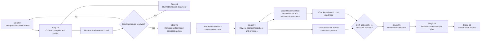
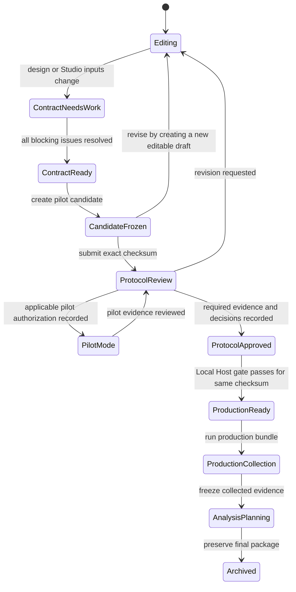

# Stage 3 — Verified Study Contract and Pilot Candidate Architecture

Status: proposed; awaiting implementation approval

Scope: Stage 03, Steps 05 and 06, plus their handoff contracts

Product code changed by this proposal: none

Visual review board: [Cerise Scholar Stage 3 Architecture](https://www.figma.com/board/PjKGE6Rt5mivhrKs7wq9ub)

## Decision summary

Stage 03 should keep its existing six stable step IDs, but Steps 05 and 06
should stop using the generic guided canvas.

- Step 05 becomes **Verify Data and Analysis Contract**. It compares the
  conceptual study design with the runnable Experimental Studio document and
  makes unresolved mismatches explicit.
- Step 06 becomes **Create Pilot Release Candidate**. It runs bounded
  preflight and rehearsal checks, shows the release diff, and delegates the
  actual immutable freeze/export operation to the existing Release Center.
- Stage 04 orchestrates ethics review, expert feedback, pilot authorization and
  results, protocol revision, and institutional or supervisory approval tied
  to the exact candidate checksum.
- The Local Research Host remains responsible for real pilot evidence and its
  existing checksum-bound production launch gate. Stage 03 must not duplicate
  that mechanism or claim that a rehearsal is a completed pilot.
- Stage 06 later turns the frozen design-time contract into the more detailed
  analysis plan. Changes are recorded as deviations or amendments; the frozen
  release is never edited.
- Stage 08 remains responsible for the final preservation and reproducibility
  archive.

The resulting progression is:

`design intent → runnable study → verified contract → pilot candidate → governance and local-pilot cycle → approved and operationally ready release → production collection → analysis plan → archive`

## Why the current Steps 05 and 06 feel redundant

Both steps currently use `GuidedCanvas`, which renders two free-text areas,
self-attestation checkboxes, and generic handoff notes. Their titles differ,
but neither screen consumes the structured Study Design, Experimental Studio,
release, or analysis-contract models already present in the application.

The duplication is architectural rather than merely visual:

1. Step 04 already authors variables, runtime checks, diagnostics, and releases.
2. Step 05 asks the researcher to describe the same procedure and analysis
   relationship again in prose.
3. Step 06 asks the researcher to describe checks and release contents again,
   while the existing Release Center already performs those operations.
4. Completion for Steps 05 and 06 is currently manual even though the relevant
   readiness signals can be derived.

The redesign assigns each screen a distinct artifact and transition rather
than deleting either step.

## Target six-step responsibility model

| Step | Stable responsibility | Primary artifact | Completion rule |
| --- | --- | --- | --- |
| 01 Select Design | Choose and justify the study design | `StudyDesignDocument.design` | Existing structured readiness |
| 02 Map Measures | Define research questions, constructs, hypotheses or qualitative purposes, and measures | Conceptual evidence model inside `StudyDesignDocument` | Existing structured readiness |
| 03 Plan Participants | Specify sampling, assignment, inclusion, accessibility, and power rationale | Participant plan inside `StudyDesignDocument` | Existing structured readiness |
| 04 Build Study | Author screens, tasks, stimuli, branching, scoring, and produced variables | `ExperimentStudioDocument` | Existing Studio diagnostics |
| 05 Verify Contract | Reconcile design intent with implemented evidence and analysis commitments | Mutable `StudyContractDraft` plus derived readiness | No unresolved blocking contract issue |
| 06 Create Pilot Candidate | Rehearse, validate, diff, freeze, version, and export a pilot-ready package | Immutable `ExperimentRelease` and checksum | Verified candidate created from the current inputs |

The stable persisted IDs `stage-03-step-01` through `stage-03-step-06` must not
be renamed or renumbered.

## Architecture boundaries

### Step 02 versus Step 05

Step 02 answers, “What do we intend to learn and how will it be measured?”
Step 05 answers, “Does the runnable study actually produce the evidence the
intent requires, and is the planned interpretation specified enough to
freeze?”

Step 05 may link back to Step 02 to repair a conceptual gap and to Step 04 to
repair an implementation gap. It must not silently invent either one.

### Step 05 versus the Stage 06 Analysis Plan

The Step 05 contract is a prospective, design-time contract. It captures the
minimum commitments needed to make the study and its evidence traceable before
collection. The Stage 06 Analysis Plan is a release-bound operational plan
used after collection and before analysis execution.

The Stage 06 editor should be seeded from the frozen Step 05 contract, but it
may require more detail. If a researcher changes a frozen commitment, the
analysis layer records the changed value, reason, timing, and data-access
declaration as a deviation or amendment. It never rewrites the release.

Cerise must not call either artifact a preregistration unless a future feature
adds the necessary external timestamp, publication, and governance guarantees.

### Step 06 versus Stage 04

Step 06 establishes that a package is technically and scientifically coherent
enough to be reviewed and piloted. It does not grant ethics approval, certify
validity, or authorize production collection.

Stage 04 may surround the actual pilot: governance rules can require approval
before involving pilot participants, while final collection approval can
depend on the pilot result. Its review records should therefore be append-only
metadata bound to:

- project ID;
- release ID;
- release checksum;
- analysis-contract checksum;
- reviewer role and decision;
- approval scope, timestamp, and optional expiry;
- unresolved conditions and supporting artifact references.

Changing the study creates a new release checksum and makes earlier approval
records inapplicable to the new candidate without deleting their history.

### Step 06 versus the Local Research Host

Step 06 may run browser-side preflight and participant-flow rehearsal, but it
cannot claim that representative participants or target hardware were piloted.
The Local Research Host already stores `launch-readiness.json`, bound to the
release checksum, and blocks production until its pilot and operational checks
pass.

That existing native boundary remains authoritative for:

- a completed pilot session for the same release;
- representative browser and device confirmation;
- consent, refusal, and withdrawal rehearsal;
- interruption and checkpoint recovery;
- local storage, SQLite, and workspace write checks;
- pilot/production data separation;
- the production-mode launch decision.

Stage 04 may later import an aggregate readiness receipt from the Host. It must
never copy participant rows or media into the web application.

## System context



## Lifecycle and invariants



The following invariants are non-negotiable:

1. Derived readiness is recomputed from normalized content and is never trusted
   from browser storage or an imported file.
2. An immutable release is never edited. Any material change creates a new
   release and checksum.
3. Approval, pilot readiness, collection, and analysis artifacts refer to the
   exact release checksum they evaluated.
4. Browser and network input is normalized and bounded before persistence or
   comparison.
5. Stage 03 planning artifacts contain no participant responses or media.
6. Quantitative, qualitative, and mixed-method studies use explicit lanes;
   qualitative work is not forced into statistical fields.
7. No UI badge uses “approved,” “validated,” or “production ready” unless the
   owning subsystem has supplied the corresponding checksum-bound evidence.

## Proposed domain model

### StudyContractDraft

Introduce a mutable, project-scoped document that stores researcher decisions
keyed to stable source IDs. Generated rows, source content, drift, and readiness
belong to a compiled view and are not persisted as authoritative draft state.

```ts
type StudyMethodLane = "quantitative" | "qualitative" | "mixed";

type StudyContractDraft = {
  schemaVersion: 1;
  projectId: string;
  methodLane: StudyMethodLane;
  reviewedSource: ContractSourceFingerprint | null;
  questionDecisions: ContractQuestionDecision[];
  variableDecisions: ContractVariableDecision[];
  quantitativePlan: QuantitativeContractPlan | null;
  qualitativePlan: QualitativeContractPlan | null;
  mixedMethodsPlan: MixedMethodsContractPlan | null;
  globalDecisions: ContractGlobalDecisions;
  researcherNotes: string;
  updatedAt: string;
};

type CompiledStudyContract = {
  draft: StudyContractDraft;
  source: ContractSourceFingerprint;
  researchQuestions: ContractQuestionMapping[];
  variables: ContractVariable[];
  changeSummary: ContractChangeSummary;
  readiness: StudyContractReadiness;
};
```

The frozen analysis-contract schema 2 is produced from the normalized compiled
view. Local storage may contain an obsolete or forged source fingerprint, but
that value can only cause a drift warning; it cannot make the current compiled
view ready.

### Source fingerprint

```ts
type ContractSourceFingerprint = {
  studyDesignSchemaVersion: number;
  studyDesignUpdatedAt: string;
  studyDesignDigest: string;
  studioSchemaVersion: number;
  studioUpdatedAt: string;
  studioDigest: string;
};
```

The digests cover only normalized fields that affect the contract. UI-only
state must not invalidate scientific review.

### Research-question mapping

Each row represents one traceable claim path:

```ts
type ContractQuestionMapping = {
  id: string;
  questionId: string;
  wording: string;
  priority: "primary" | "secondary" | "exploratory" | "unspecified";
  evidenceLane: "quantitative" | "qualitative" | "mixed";
  constructIds: string[];
  evidenceSourceIds: string[];
  variableRoles: {
    outcomeIds: string[];
    predictorIds: string[];
    covariateIds: string[];
  };
  scoringRule: string;
  unitOfAnalysis: string;
  plannedMethod: string;
  missingnessAndExclusions: string;
  status: "mapped" | "needs-decision" | "broken-source";
};
```

For a qualitative question, `evidenceSourceIds`, analytic approach, sampling
logic, coding or interpretation approach, and reflexivity decisions are
required where applicable; outcome/predictor/covariate roles are not.

For a mixed-method question, the mapping also requires the integration point,
priority, sequence, and intended form of inference.

### Variable ledger

The ledger is generated from the runnable Studio document and may not create a
variable that the runtime does not produce. It records:

- stable variable ID and human-readable label;
- source screen, task, event, or scoring rule;
- response/data type and allowed values;
- unit, timepoint, and repeated-measure level;
- missing-value representation;
- administrative, identifying, analysis, or quality-control role;
- linked research questions and constructs;
- transformation or derived-variable provenance;
- whether the variable is collected directly or derived.

Deleting or renaming a source variable creates a reconciliation issue instead
of silently retargeting a prior mapping.

### Method-lane plans

The quantitative lane carries the current analysis-contract commitments:
designation, estimand outline, unit, planned method, effect-size target,
missingness, exclusions, transformations, multiplicity, and sensitivity plans.

The qualitative lane carries approach, evidence unit, sampling sufficiency,
coding or interpretive strategy, researcher positioning/reflexivity, negative
case handling, and credibility or trustworthiness procedures.

The mixed-method lane carries the quantitative and qualitative subplans plus
sequence, priority, integration point, joint-display or comparison strategy,
and rules for resolving divergence.

The UI should display only the applicable requirements while preserving the
other lanes when a researcher changes methods and later changes back.

### Readiness model

```ts
type ContractIssueSeverity = "blocking" | "warning" | "advisory";

type StudyContractIssue = {
  code: string;
  severity: ContractIssueSeverity;
  source: "study-design" | "studio" | "contract";
  entityId: string | null;
  message: string;
  repairTarget: "step-02" | "step-04" | "step-05";
};

type StudyContractReadiness = {
  status: "blocked" | "ready-with-warnings" | "ready";
  blockingCount: number;
  warningCount: number;
  advisoryCount: number;
  issues: StudyContractIssue[];
};
```

Completion of Step 05 is derived from `blockingCount === 0`. A researcher may
acknowledge a warning with a reason, but cannot dismiss a structural blocking
issue. Acknowledgements are recorded; they do not delete the issue.

## Contract compilation and reconciliation

The compiler is a pure domain function. Given normalized Study Design, Studio,
and prior contract draft, it returns a reconciled draft and deterministic
issues.

1. Normalize and bound all three inputs.
2. Build the current source fingerprint.
3. Extract research questions, constructs, measures, participant units, Studio
   variables, scoring rules, and event sources.
4. Match prior researcher decisions by stable IDs only.
5. Preserve valid researcher-authored decisions.
6. Mark removed source entities as broken references; never retarget by label.
7. Add new source entities as unresolved rows.
8. Recompute method-lane requirements.
9. Recompute issue severity, counts, and readiness.
10. Return a change summary used by both Step 05 and Step 06.

The compiler should be idempotent: compiling the same normalized sources and
prior decisions twice produces the same semantic document.

## Step 05 interaction design

### Step 05 page structure

1. **Source summary** — Study Design version, Studio version, last update,
   method lane, and drift status.
2. **Readiness summary** — blocking, warning, and advisory counts with a clear
   explanation that readiness is derived.
3. **Research-question matrix** — one expandable row per question showing:
   `question → construct → evidence source → variable/qualitative material → scoring or coding → unit → planned method → missingness/exclusions`.
4. **Variable and evidence ledger** — filterable generated dictionary with
   source links and unused/orphaned evidence warnings.
5. **Method-lane plan** — quantitative, qualitative, or mixed-method controls.
6. **Issues rail** — grouped issues with repair actions that open Step 02,
   Step 04, or the relevant Step 05 section.
7. **Decision notes and history** — bounded researcher rationale and the latest
   source reconciliation summary.

### Interaction rules

- Rows autosave locally using the existing project-scoped persistence pattern.
- A changed source fingerprint places the screen in “Reconciliation required.”
- “Mark step complete” becomes a derived status display and navigation action;
  it does not override readiness.
- Blank required decisions are visible as unresolved cells, not placeholder
  prose in a large text area.
- Repair links retain project context and return the researcher to Step 05.
- Accessibility requires keyboard-operable tables, semantic row headings,
  persistent text labels in addition to color, and issue summaries announced
  after reconciliation.

### Compact wireframe

```text
+-----------------------------------------------------------------------+
| Verify Data & Analysis Contract             3 blocking · 2 warnings   |
| Design v?  ·  Studio v?  ·  Mixed methods  ·  Reconciliation needed  |
+-------------------------------+---------------------------------------+
| Research-question matrix      | Issues                                |
| RQ1  Construct  Evidence      | [B] RQ1 has no produced outcome       |
|      Variable   Scoring       |     Open Build Study                  |
|      Unit       Method        | [W] Exclusion rationale is blank      |
| RQ2  Qualitative materials    |     Complete here                     |
|      Coding     Trustworthiness|                                      |
+-------------------------------+---------------------------------------+
| Variable & evidence ledger                                            |
| Method-lane decisions                                                 |
| Decision notes and reconciliation history                             |
+-----------------------------------------------------------------------+
```

## Step 06 interaction design

Step 06 is an orchestration surface over existing diagnostics and release
functions. It must not implement a second release serializer.

### Step 06 page structure

1. **Candidate summary** — current Study Design, Studio, contract, and latest
   release identities.
2. **Participant-flow rehearsal** — consent, refusal, withdrawal, completion,
   branching, interruption, and recovery results that can be tested without
   participant data.
3. **Scientific and technical preflight** — Studio blocking diagnostics,
   contract readiness, accessibility checks, timing caveats, and browser/device
   declarations.
4. **Release diff** — added, changed, or removed questions, variables, screens,
   conditions, analysis decisions, and checks since the latest release.
5. **Frozen package preview** — release format, contract schema, runner package,
   expected export files, and checksum chain.
6. **Attestations** — the existing review statements, scoped and worded as
   researcher confirmations rather than Cerise certification.
7. **Single primary action** — `Create pilot candidate`.

### Candidate gate

The action is enabled only when:

- the existing Studio freeze gate passes;
- the Step 05 contract has no blocking issue;
- the source fingerprint still matches the current Study Design and Studio;
- required browser-side rehearsals have a current pass record;
- required researcher attestations are current;
- no asynchronous checksum or persistence operation is pending.

After creation, Step 06 shows the immutable release ID and checksum, export
actions, change summary, and the explicit next action: submit this exact
candidate for Stage 04 review.

The page must call the current `createExperimentRelease` and release
persistence boundary after that boundary is extended to accept the verified
contract. Export and Host bundle creation continue to use existing functions.

## Release and approval records

### Analysis contract evolution

The current release format 5 embeds analysis-contract schema 1. The target
contract needs qualitative and mixed-method branches plus explicit source
fingerprints. Implement this as analysis-contract schema 2 and release format
6 rather than overloading schema 1.

Compatibility rules:

- release formats 1–5 remain readable and retain their original checksum
  shapes;
- analysis-contract schema 1 remains readable;
- only new format 6 releases freeze schema 2 contracts;
- old releases are never backfilled or rewritten;
- Local Research Host bundle verification must add format 6 before the web app
  exports it as a Host bundle;
- the runner package version changes only if participant execution behavior
  changes; a metadata-only release-format change does not require that bump;
- unknown future versions fail closed at import with a clear compatibility
  message.

### Approval record

The broader Stage 04 redesign should introduce a separate append-only
`ProtocolReviewRecord`. It is not embedded later into an already-frozen
release. Instead, it references the release identity and is exported beside it
when needed.

```ts
type ProtocolReviewRecord = {
  schemaVersion: 1;
  recordId: string;
  projectId: string;
  releaseId: string;
  releaseChecksum: string;
  analysisContractChecksum: string;
  recordKind:
    | "ethics-risk-review"
    | "expert-feedback"
    | "pilot-authorization"
    | "pilot-result-summary"
    | "revision-decision"
    | "collection-approval";
  outcome:
    | "recorded"
    | "approved"
    | "approved-with-conditions"
    | "revision-requested"
    | "not-required"
    | "rejected";
  scope: string;
  reviewerRole: string;
  createdAt: string;
  reviewedAt: string;
  expiresAt: string | null;
  conditions: string[];
  evidenceReferences: string[];
};
```

Cerise records researcher-supplied governance metadata; it does not represent
itself as an ethics board or infer that a given institution accepts the record.

### Host readiness receipt

A later cross-app handoff may export an aggregate, checksum-bound Host receipt
containing only check identifiers, pass/fail state, timestamps, Host version,
and the release checksum. No session values, identifiers, free text, audio, or
video may cross this boundary.

Until that receipt format exists, Stage 03 and Stage 04 must not display a
production-ready badge. The native Host remains the source of truth.

## Persistence and migration

### Mutable contract draft

Use a new bounded, project-scoped local key rather than expanding the generic
Research Path draft:

`cerise-study-contract:{projectId}:v1`

The draft normalizer and compiler should:

- reject documents above the configured byte bound;
- cap counts and string lengths consistently with current research models;
- discard unknown keys;
- recompute source drift and readiness after loading the normalized draft;
- preserve decisions only when their stable source IDs remain valid;
- quarantine malformed input by returning a safe empty/recompiled draft.

Remote sync is intentionally outside the first Stage 03 build slice. The
verified contract is still preserved remotely when it becomes part of the
existing immutable release manifest. Adding editable cloud sync later requires
an explicit conflict-resolution and schema-migration design.

### Existing generic Step 05 and Step 06 content

Do not delete prior user text or check states. On first opening a redesigned
step:

1. retain the original generic fields in the existing Research Path draft;
2. show non-empty values in a collapsed, read-only `Legacy notes` panel;
3. do not treat legacy checkboxes as structured readiness evidence;
4. allow copy/export but no automatic semantic conversion;
5. keep the existing step IDs so navigation and completion history remain
   stable.

### Releases

The existing local maximum and cloud fail-open behavior should remain unless a
separate storage review changes them. A candidate must not be reported as
created until its manifest, embedded contract, and release checksum have all
been generated and the chosen persistence target confirms success.

## Component and module plan

Names are proposals; implementation should follow current repository naming
conventions.

### New domain modules

- `src/lib/research/studyContract.ts` — schema, normalization, compiler,
  reconciliation, issue derivation, and method-lane validation.
- `src/lib/research/studyContractPersistence.ts` — bounded project-local draft
  persistence and migration.
- `src/lib/research/releasePreflight.ts` — pure aggregation of Studio,
  contract, rehearsal, and attestation readiness.
- `src/lib/research/releaseDiff.ts` — semantic diff between current candidate
  inputs and the latest compatible release.
- `src/lib/research/protocolReview.ts` — Stage 04 checksum-bound record model;
  implement only in the later Stage 04 slice.

### New or replaced UI modules

- `src/components/research-path/StudyContractLauncher.tsx` — Step 05 entry and
  workspace shell.
- `src/components/study-contract/ContractWorkspace.tsx` — matrix, method lanes,
  ledger, issue rail, and reconciliation state.
- `src/components/research-path/PilotCandidateLauncher.tsx` — Step 06 entry and
  candidate orchestration.
- `src/components/experimental-studio/ExperimentPackagePanel.tsx` — extract
  reusable release actions/panels; keep one implementation of freeze/export.

### Existing modules to extend

- `src/lib/research/researchPathConfig.ts` — add dedicated canvas kinds for the
  two stable step IDs.
- `src/components/research-path/ResearchPathWorkspace.tsx` — route those kinds
  to launchers and remove manual completion authority for them.
- `src/lib/research/analysisContract.ts` — add schema 2 compilation and
  normalization while retaining schema 1 parsing.
- `src/lib/research/experimentRelease.ts` — add format 6 and require a verified,
  fingerprint-current contract for new candidates.
- `src/lib/research/experimentReleasePersistence.ts` — persist format 6 without
  changing old records.
- `src/lib/research/experimentHostBundle.ts` — add format 6 identity and
  verification after native Host support exists.
- `src/lib/research/analysisPlan.ts` — seed from schema 2 and represent any
  post-freeze change as a recorded deviation.

### Native Host coordination

The web app must not export Host bundle format 6 until the Swift Host can
verify it independently. Recommended order:

1. add shared fixtures for release and contract format 6;
2. implement and self-test native verification;
3. add web Host-bundle format 6 export;
4. run cross-runtime checksum fixtures;
5. enable the Step 06 Host export action.

Plain release export may be enabled earlier because it does not claim native
compatibility.

## Build slices

Each slice should be independently reviewable and leave the current workflow
usable.

### Slice A — Contract domain foundation

- Add `StudyContractDraft`, method lanes, compiler, reconciliation, and
  readiness functions.
- Add bounded local persistence.
- Add analysis-contract schema 2 and backward-compatible parsing.
- Add deterministic fixtures and source-drift tests.
- Do not change release format or UI completion yet.

Exit criterion: the same normalized inputs always produce the same derived
contract core and issues, and schema 1 fixtures remain valid.

### Slice B — Step 05 workspace

- Add the dedicated canvas kind and launcher.
- Implement the RQ matrix, variable/evidence ledger, lane panels, issue rail,
  autosave, legacy-notes panel, and repair navigation.
- Derive Step 05 completion from current readiness.
- Keep Step 06 on its old screen until this slice is accepted.

Exit criterion: a user can reconcile quantitative, qualitative, and mixed
fixtures without editing raw JSON, and source changes invalidate completion.

### Slice C — Candidate release foundation

- Add release format 6 and freeze a verified schema 2 contract.
- Add semantic release diff and release preflight aggregation.
- Preserve format 1–5 reads and checksum verification.
- Add tamper and cross-version fixtures.

Exit criterion: format 6 candidate creation is deterministic and old releases
remain readable without mutation.

### Slice D — Step 06 workspace

- Replace the generic canvas with rehearsal, preflight, diff, package preview,
  attestations, and one candidate action.
- Reuse the existing Release Center operations.
- Derive Step 06 completion from a persisted candidate whose source identities
  still match.
- Preserve legacy notes.

Exit criterion: there is exactly one release creation path and Step 06 cannot
claim completion after design or Studio drift.

### Slice E — Native Host format 6

- Add independent Swift parsing and checksum verification.
- Extend `--self-test` and cross-runtime fixtures.
- Enable pilot and production Host bundle export for format 6.
- Preserve the current native `launch-readiness.json` authority.

Exit criterion: tampered contract, release, runner, or bundle content fails
closed in both runtimes.

### Slice F — Stage 04 approval binding

- Replace generic approval prose with checksum-bound review records.
- Treat revision as a new candidate, never a mutation.
- Keep ethics/institutional claims accurately scoped.
- Optionally design the aggregate Host readiness receipt; do not import
  participant data.

Exit criterion: the UI can prove which exact candidate was reviewed and makes
stale approval unmistakable after a revision.

### Slice G — Collection and analysis handoff

- Add the release/approval identity to Stage 05 collection metadata.
- Seed the Stage 06 Analysis Plan from contract schema 2.
- Add an explicit deviation/amendment ledger before allowing a frozen decision
  to change.
- Roll out collection blocking only after Stage 04 and Host integrations have
  shipped; use advisory messaging during migration.

Exit criterion: every production dataset and analysis plan can trace back to
the immutable release and contract it used.

## Verification strategy

### Domain unit tests

- deterministic compilation and checksum inputs;
- quantitative, qualitative, and mixed-method requirements;
- stable-ID reconciliation for add/remove/rename cases;
- orphan variables and unmapped research questions;
- source-fingerprint drift;
- issue severity and derived completion;
- bounds, malformed storage, and unknown keys;
- schema 1 to schema 2 compatibility behavior;
- semantic release diff categories.

### Release and integrity tests

- format 1–5 fixtures remain readable and checksum-valid;
- format 6 round-trip and canonical checksum;
- contract tamper invalidates contract and release;
- release tamper invalidates Host bundle;
- unknown versions fail closed;
- failed persistence does not show a created candidate;
- immutable releases are never overwritten.

### Component tests

- keyboard access and screen-reader labels for the matrix and issue rail;
- method-lane conditional requirements;
- autosave and reload;
- repair navigation and return context;
- legacy notes are preserved but do not affect readiness;
- source changes clear derived completion;
- a single candidate action cannot double-submit;
- warning acknowledgement requires a bounded rationale.

### End-to-end scenarios

1. Quantitative study: design → Studio → reconcile → freeze → export.
2. Qualitative study: materials and coding plan without statistical coercion.
3. Mixed-method study: two evidence lanes plus integration decision.
4. Rename/delete a mapped variable and repair the broken contract.
5. Freeze a candidate, revise the Studio, and confirm approval is stale.
6. Import pilot and production bundles into the Host and confirm native pilot
   data remains isolated and production remains gated.
7. Open the Stage 06 Analysis Plan and verify contract identity plus recorded
   deviation behavior.
8. Load legacy Step 05/06 notes and releases without data loss.

### Quality gates per slice

- focused unit/component tests;
- `npx tsc --noEmit`;
- `npm run lint`;
- relevant build/test command from the repository scripts;
- local browser smoke test at a project-scoped URL;
- visual review at narrow and wide desktop sizes;
- `git diff --check` and a scoped change audit;
- native self-test for slices that touch the Local Research Host.

## Privacy, security, and scientific-claim controls

- Planning, contract, review, and readiness records contain metadata only.
- Never upload or sync participant rows, media, session free text, or native
  workspace paths through this feature.
- Escape exported CSV content and bound every imported string/list/document.
- Canonical checksums are integrity evidence, not identity or institutional
  signatures.
- Researcher attestations must record who made the claim in local/project
  context without presenting Cerise as the certifying authority.
- The app must distinguish `rehearsal passed`, `pilot completed`, `protocol
  approved`, and `production ready`; those states are not synonyms.
- No automatic method recommendation should be presented as scientifically
  correct. Suggestions, if added later, require rationale, uncertainty, and an
  explicit researcher decision.

## Rollout and migration controls

- Ship behind a project-scoped feature flag until old and new release flows
  pass the same integrity suite.
- Start with read/write of the new mutable contract while retaining the old
  guided fields as legacy notes.
- Enable format 6 release creation only after schema and compatibility tests.
- Enable format 6 Host bundles only after native verification ships.
- Keep the current collection path advisory during migration; do not strand an
  existing project merely because it predates contract schema 2.
- Introduce strict approval/production gates only for newly created format 6
  candidates, with an explicit legacy-release explanation.
- Record format/version metrics locally or in existing privacy-safe product
  telemetry only; never include research content.

## Acceptance criteria for the complete architecture

1. Steps 05 and 06 have distinct structured artifacts and no longer render the
   generic two-textarea canvas.
2. Every research question has a traceable path to implemented evidence and an
   applicable interpretation or analysis approach.
3. Every runtime-produced variable is defined, classified, and either used or
   explicitly marked administrative/unused with rationale.
4. Qualitative and mixed-method studies can reach readiness without fake
   statistical fields.
5. Step completion is derived and becomes stale when its source changes.
6. Candidate creation uses one existing release boundary and produces an
   immutable checksum chain.
7. Stage 04 review and Host readiness refer to the exact candidate checksum and
   do not duplicate one another.
8. Production data remains local and pilot/production separation remains
   enforced by the Host.
9. Old drafts, notes, release formats, and contract schema 1 remain readable.
10. The Stage 06 Analysis Plan preserves frozen decisions and records later
    changes rather than rewriting history.

## Explicit non-goals

- Building or changing product code before approval.
- Replacing the Experimental Studio or Local Research Host.
- Cloud participant-data collection or storage.
- Automatic ethics approval, preregistration, or scientific certification.
- A new statistical engine inside Stage 03.
- Requiring a native Host pilot before a pilot candidate can be created.
- Backfilling old releases with decisions that were not frozen at the time.

## Decisions requested before implementation

Approval of this architecture authorizes the build slices, but the following
product decisions should be confirmed at kickoff:

1. Use the proposed labels **Verify Data & Analysis Contract** and **Create
   Pilot Candidate**.
2. Treat format 6 as the first strict contract-gated release, while preserving
   advisory handling for legacy releases.
3. Ship editable contract drafts local-first and defer cloud draft sync.
4. Build Stage 04 checksum-bound approval as a separate slice after the two
   Stage 03 screens.
5. Keep the Local Research Host as the sole production-readiness authority and
   exchange only an aggregate receipt in a future integration.
