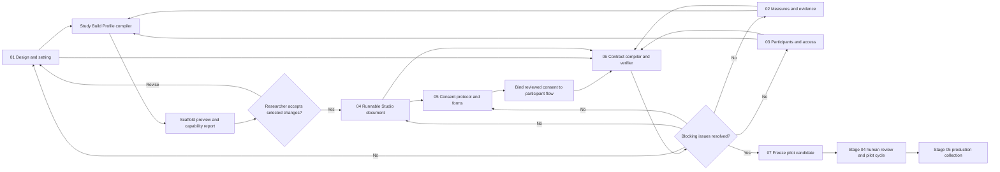

# Stage 3 — Generative Study Builder and Dependency Architecture

Status: proposed; awaiting implementation approval

Scope: the dependency flow from Stage 03 design decisions through the runnable
study, consent artifact, verified contract, and pilot candidate

Product code changed by this proposal: none

Visual review board:
[Cerise Scholar Stage 3 Architecture](https://www.figma.com/board/PjKGE6Rt5mivhrKs7wq9ub)

Related proposals:

- [Stage 3 consent and participant-rights architecture](./stage-3-consent-and-participant-rights-architecture.md)
- [Stage 3 verified-contract and pilot-candidate architecture](./stage-3-contract-and-pilot-release-architecture.md)

## Decision summary

Stage 03 should behave as a connected artifact pipeline rather than seven
independent forms.

1. **Select Design** chooses the methodological design and study setting.
2. **Map Measures** describes the questions, constructs, measures, and evidence
   the study intends to produce.
3. **Plan Participants** describes the population, sampling, assignment,
   accessibility, device, and participation requirements.
4. A deterministic **Study Build Profile compiler** combines those sources into
   a proposed runnable-study scaffold, validation profile, and capability report.
5. The researcher previews and explicitly accepts, edits, or rejects the
   proposal before **Build Study** creates anything.
6. **Design Consent** reads the implemented participant flow, compiles the facts
   participants must be told, and binds a reviewed consent artifact to the
   runnable experiment.
7. **Verify Contract** checks that the design, measures, participant plan,
   runnable flow, consent, variables, and analysis commitments describe the
   same study.
8. **Create Pilot Candidate** freezes and exports the exact coherent set of
   artifacts. It is blocked when consent is missing, stale, unbound, or does not
   match the runnable form.

The compiler is deterministic. AI may explain the proposed profile, suggest
optional refinements, and flag semantic mismatches, but it must not silently
choose a design, overwrite a study, or represent a generated scaffold as
scientifically or ethically approved.

## Current implementation audit

The user's concern is correct: the current Build Study default does not yet
materially vary by selected design or setting.

`StudyDesignDocument` already records useful upstream decisions:

- goal;
- setting: online, laboratory, field, or hybrid;
- selected design: randomized between-groups, within-subjects,
  quasi-experimental, cross-sectional survey, longitudinal, observational,
  qualitative, or mixed methods;
- constraints and available devices;
- research questions, constructs, measures, and operational definitions;
- population, sampling, recruitment, conditions, allocation,
  counterbalancing, device, and accessibility requirements.

However, `createExperimentStudioDocument()` currently always creates the same
five blocks:

`welcome → generic consent → instructions → one rating item → debrief`

Only the first non-empty research question changes the heading, prompt, and
variable name of the default rating item. The selected design, setting,
participant plan, assignment requirements, devices, qualitative lane, and
mixed-method integration do not alter the generated Studio document.

The selected design and setting are passed to the Studio AI assistant and later
carried into contract/release provenance, but that is context, not a generated
runtime architecture. Consequently, an online survey completed at home and a
randomized laboratory experiment receive essentially the same initial study.

### Current versus target behavior

| Concern            | Current behavior                      | Target behavior                                                              |
| ------------------ | ------------------------------------- | ---------------------------------------------------------------------------- |
| Selected design    | Stored and shown to AI                | Compiles design-specific modules, requirements, and validators               |
| Study setting      | Stored and shown to AI                | Compiles setting-specific execution defaults and checks                      |
| Research questions | First question seeds one rating block | All applicable questions map to proposed evidence-producing modules          |
| Participant plan   | Mostly planning-only                  | Informs assignment, accessibility, device, recruitment, and consent variants |
| Existing Studio    | Generic five-block fallback           | Researcher-approved composed scaffold with source identity                   |
| Upstream change    | No explicit reconciliation            | Semantic drift report and selective reconciliation                           |
| Consent            | Generic runtime choice block          | Structured, reviewed artifact bound to the runtime before export             |
| Readiness          | Generic/manual step completion        | Derived issues with explicit repair targets                                  |

## The connected Stage 3 workflow

The visible seven-step sequence remains:

| Visible step              | Core question                                              | Artifact produced or updated        |
| ------------------------- | ---------------------------------------------------------- | ----------------------------------- |
| 01 Select Design          | What kind of study is this, where will it run, and why?    | `StudyDesignDocument.design`        |
| 02 Map Measures           | What will answer each research question?                   | Evidence model and planned measures |
| 03 Plan Participants      | Who participates and what must the procedure support?      | Participant and assignment plan     |
| 04 Build Study            | What will participants actually see and do?                | `ExperimentStudioDocument`          |
| 05 Design Consent         | What must participants know and decide before beginning?   | Bound consent protocol and forms    |
| 06 Verify Contract        | Do all artifacts describe the same study?                  | Verified mutable study contract     |
| 07 Create Pilot Candidate | Can this exact version be frozen for review and pilot use? | Immutable release and checksums     |

The connection is a directed dependency graph, not a one-time wizard:



### Dependency and invalidation rules

| Source changes                 | Directly affected output                                         | Required downstream behavior                                     |
| ------------------------------ | ---------------------------------------------------------------- | ---------------------------------------------------------------- |
| Design or setting              | Build profile and Studio recommendations                         | Mark profile reconciliation required; never overwrite the Studio |
| Research question or measure   | Proposed blocks, variables, scoring, evidence mappings           | Diff affected mappings and invalidate contract readiness         |
| Participant or assignment plan | Conditions, allocation, access, device, and consent requirements | Re-run profile and participant-rights checks                     |
| Studio procedure               | Burden, data categories, participant flow, consent facts         | Mark consent source stale and contract unverified                |
| Consent text or choices        | Runtime consent reference and participant-rights mapping         | Re-bind consent and invalidate candidate checksum                |
| Contract decision              | Candidate inputs                                                 | Require a new candidate checksum                                 |

No upstream edit deletes or silently rewrites downstream work. It changes the
source fingerprint, produces a semantic diff, and requires a researcher action.

## Consent must be inside the experiment before export

Yes: the final reviewed consent must be part of the runnable participant flow
before a pilot candidate may be created or exported.

“Upload” is only one possible source action. The important architectural action
is **bind**:

1. A researcher may upload an institutional DOCX or PDF template as source
   evidence, start from a Cerise structure, or author a form manually.
2. Cerise maps that source into structured clauses, choices, participant groups,
   language variants, data practices, and withdrawal behavior.
3. The researcher reviews and explicitly marks a version ready for human review.
4. **Bind reviewed consent to study** places a reference to the exact form and
   checksum at the correct point in the runnable Studio flow.
5. The participant runner renders the semantic form and enforces accept,
   decline, optional recording, and withdrawal behavior.
6. Contract verification checks that the form describes the actual procedure
   and that the Studio points to the same checksum.
7. Release creation freezes the source attachment identity, consent protocol,
   rendered form, runtime reference, contract, and release checksum.

Merely attaching a PDF is insufficient because a file attachment cannot by
itself tell the runner which choices are required, what happens on refusal,
whether recording is optional, which audience/language applies, or whether the
form still matches the implemented study. The original file should be retained
as a provenance attachment, while the participant-facing runtime uses the
reviewed structured artifact.

### Export gate

`Create pilot candidate` is blocked when any of the following is true:

- no applicable consent form is bound;
- the bound form checksum differs from the reviewed form;
- the Studio has changed since consent facts were reviewed;
- a recording or sensitive-data path lacks the applicable separate choice;
- decline does not end the flow safely;
- withdrawal language and implemented deletion behavior conflict;
- the contract contains an unresolved participant-rights issue;
- the release package cannot reproduce the exact participant-facing form.

The action is a **pilot-candidate export**, not production approval. Human
governance review and operational pilot evidence remain downstream in Stage 04
and the Local Research Host.

## Why composition is better than a template explosion

Design and setting are orthogonal. “Cross-sectional survey” describes the
method; “online at home” describes the execution environment. Hardcoding a
template for every design × setting × participant × modality combination would
be brittle and difficult to validate.

The Study Build Profile should compose independent modules:

```text
base participant flow
+ design module
+ setting module
+ evidence/measure modules
+ participant and assignment module
+ accessibility and device module
+ data-practice and consent module
= proposed scaffold, validators, defaults, and capability report
```

Each module emits structured recommendations rather than directly mutating the
Studio. Conflicts are resolved by explicit precedence and surfaced to the
researcher.

### Precedence model

1. Safety, consent, privacy, and unsupported-capability blockers.
2. Explicit researcher decisions and recorded overrides.
3. Participant accessibility and required device constraints.
4. Method/design requirements.
5. Setting defaults.
6. General product defaults.

For example, the online setting may recommend allowing back navigation, while
a time-sensitive task may recommend preventing it. The compiler reports the
conflict and rationale instead of silently selecting one.

## Method/design modules

### Randomized between-groups

Proposed scaffold capabilities:

- two or more named conditions;
- explicit allocation method and ratio;
- manipulation or condition-specific blocks;
- primary and secondary outcome blocks;
- optional manipulation/attention checks;
- assignment receipt and deterministic preview seed;
- condition-aware branching and data dictionary entries;
- validation that an outcome is produced after assignment.

The compiler should warn when the participant plan says “randomized” but the
Studio uses a single condition, or when the runtime condition weights conflict
with the planned allocation ratio.

### Within-subjects

Proposed scaffold capabilities:

- repeated conditions or measurements per participant;
- order or counterbalancing strategy;
- carryover, fatigue, practice, and washout prompts;
- trial or condition loop;
- within-participant unit-of-analysis identity;
- validation of condition order and repeated outcome production.

### Quasi-experimental

Proposed scaffold capabilities:

- naturally occurring group or exposure field;
- no false claim of random assignment;
- baseline/covariate prompts;
- confounding and comparability warnings;
- intervention/exposure timing where applicable;
- group mapping without random allocation.

### Cross-sectional survey

Proposed scaffold capabilities:

- welcome, consent, instructions, measure sections, optional demographics, and
  debrief/submit;
- grouped items, response requirements, skip logic, and progress behavior;
- responsive input controls suitable for unsupervised completion;
- no condition assignment unless the researcher explicitly adds it;
- no default fullscreen or focus logging;
- validation for missing measures, conflicting required/optional fields, and
  excessive burden.

### Longitudinal or repeated-wave study

Proposed scaffold capabilities:

- wave definitions and repeated measures;
- schedule, interval, retention, reminder, and attrition planning;
- cross-session participant linkage policy;
- per-wave consent/re-consent rules;
- comparability and version-drift checks.

The compiler must report unsupported capabilities honestly. If the current
runner cannot provide privacy-preserving cross-session identity, scheduling, or
reminders, Cerise should offer a bounded alternative such as separate
release-bound waves, or block the unsupported launch path. It must not create a
single-session survey and label it longitudinal.

### Observational

Proposed scaffold capabilities:

- event, behavior, interval, or coding schema;
- observer instructions and reliability plan;
- natural-setting/context fields;
- privacy and third-party data prompts;
- no manipulation or randomization requirements;
- optional observation session and field-note modules.

### Qualitative

Proposed scaffold capabilities:

- interview, focus-group, diary, open-text, or artifact-prompt modules;
- topic guide rather than forced predictor/outcome fields;
- optional audio/video capture with separate recording choices;
- pause, skip, and participant-control behavior;
- qualitative evidence source and interpretation mappings;
- transcription, de-identification, retention, and access decisions.

Group focus groups and multi-party recording consent should remain an explicit
capability gap until identity and group-consent behavior are implemented.

### Mixed methods

Proposed scaffold capabilities:

- explicitly named quantitative and qualitative modules;
- sequence: convergent, explanatory sequential, exploratory sequential, or
  researcher-defined;
- cross-lane participant and variable identity;
- integration question and planned merge point;
- separate validation for each lane plus integration readiness;
- consent language covering every applicable data modality.

Qualitative work must never be forced into statistical variable roles merely
because a quantitative module is also present.

## Setting modules

### Online or at home

Recommended defaults and checks:

- responsive mobile and desktop layouts;
- no assumed researcher presence;
- interruption, refresh, and checkpoint recovery;
- conservative bandwidth and media behavior;
- privacy guidance for shared devices and spaces;
- browser/device support statement;
- no default fullscreen or focus logging unless scientifically justified;
- participant-controlled exit and support/contact access;
- realistic home-completion timing and burden rehearsal.

### Laboratory

Recommended defaults and checks:

- researcher-controlled or representative device profile;
- room, equipment, calibration, and peripheral checks;
- researcher setup and participant handoff instructions;
- timing diagnostics where the task depends on latency;
- fullscreen and focus monitoring only when justified and disclosed;
- session reset and pilot/production separation;
- researcher-assisted refusal and withdrawal rehearsal.

### Field

Recommended defaults and checks:

- intermittent connectivity and recovery strategy;
- device battery, storage, and permission checks;
- environmental variability and context fields;
- privacy around bystanders and third-party observations;
- location/safety considerations without collecting unnecessary location data;
- bounded offline behavior where the runner actually supports it.

### Hybrid

Recommended defaults and checks:

- explicit branches or separate entry points for each setting;
- shared core protocol plus named setting-specific deviations;
- comparable measures and variable identity across settings;
- per-setting device, support, consent, and rehearsal checks;
- setting recorded as an administrative/context variable when justified;
- contract checks for unintended procedural differences.

Hybrid must not mean “use generic defaults everywhere.” It means the common
protocol and each permitted setting variation are explicit and reviewable.

## Composition examples

| Design + setting                       | Proposed participant flow                                                                                          | Important defaults/checks                                                       |
| -------------------------------------- | ------------------------------------------------------------------------------------------------------------------ | ------------------------------------------------------------------------------- |
| Cross-sectional survey + online/home   | Welcome → structured consent → survey sections → optional demographics → debrief/submit                            | Responsive controls, interruption recovery, no default fullscreen/focus logging |
| Randomized between-groups + laboratory | Welcome → consent → lab instructions → allocation → condition task/trials → manipulation check → outcome → debrief | Equipment/timing checks, assignment integrity, session reset                    |
| Qualitative + online/home              | Welcome → consent → separate recording choice → interview/diary prompts → participant review/submit → debrief      | Pause/skip, upload limits, privacy at home, no forced quantitative outcome      |
| Observational + field                  | Observer setup → applicable consent/notice → observation schema → context/event recording → session close          | Third-party privacy, intermittent connectivity, coding/reliability plan         |
| Mixed methods + hybrid                 | Shared consent → setting branch → quantitative module → qualitative module → integration metadata → debrief        | Same construct identity, per-setting deviations, all modalities disclosed       |

These are proposed starting points, not locked protocols. The researcher owns
the scientific choice and may customize every accepted module.

## Proposed domain model

### StudyBuildProfile

```ts
type StudyBuildProfile = {
  schemaVersion: 1;
  projectId: string;
  sourceFingerprint: StudyBuildSourceFingerprint;
  designKind: StudyDesignKind;
  setting: StudySetting;
  methodLanes: Array<"quantitative" | "qualitative">;
  modules: StudyBuildModuleRecommendation[];
  execution: StudyExecutionRecommendation[];
  requiredChecks: StudyBuildCheck[];
  recommendedChecks: StudyBuildCheck[];
  capabilityFindings: StudyCapabilityFinding[];
  conflicts: StudyBuildConflict[];
  rationale: StudyBuildRationale[];
};

type StudyBuildSourceFingerprint = {
  studyDesignChecksum: string;
  designDecisionChecksum: string;
  measuresChecksum: string;
  participantPlanChecksum: string;
};
```

The profile is compiled and reproducible. It is not stored as authoritative
truth. The stored source decisions and researcher reconciliation records are
authoritative; the profile is recomputed from them.

### Recommendation and evidence

```ts
type StudyBuildModuleRecommendation = {
  id: string;
  moduleKind: string;
  status: "required" | "recommended" | "optional" | "unsupported";
  sourceRefs: StudySourceRef[];
  proposedBlocks: ExperimentBlockProposal[];
  proposedVariables: ExperimentVariableProposal[];
  rationale: string;
};

type StudyCapabilityFinding = {
  id: string;
  capability: string;
  status: "supported" | "supported-with-limits" | "unsupported";
  severity: "blocking" | "warning";
  message: string;
  repairTarget: "design" | "measures" | "participants" | "studio";
};
```

Every recommendation must be traceable to a source decision or a documented
product default. A user should be able to ask, “Why did Cerise propose this?”
and receive a concrete answer.

### Studio source link and reconciliation record

```ts
type StudioSourceLink = {
  profileChecksum: string;
  generatedAt: string;
  appliedRecommendationIds: string[];
  generatedBlockIds: string[];
  researcherOverrides: StudyBuildOverride[];
  reconciliationStatus:
    "current" | "source-changed" | "resolved-with-overrides";
};

type StudyBuildOverride = {
  id: string;
  recommendationId: string;
  decision: "accept" | "modify" | "decline" | "defer";
  reason: string;
  decidedAt: string;
};
```

The Studio remains a researcher-owned editable artifact. The source link records
what was generated and why; it never turns the Studio into a read-only template.

## Compiler architecture

Introduce small, testable registries rather than a single branching function:

- `StudyDesignModuleRegistry` maps each design kind to requirements and module
  factories.
- `StudySettingModuleRegistry` maps each setting to execution defaults and
  environment checks.
- `StudyMeasureModuleRegistry` maps measure/evidence kinds to compatible Studio
  blocks and variable roles.
- `StudyParticipantModuleRegistry` maps participant and allocation needs to
  assignment, accessibility, device, and participant-flow requirements.
- `StudyCapabilityRegistry` reports which requested behaviors the current web
  runner and Local Host truly support.
- `compileStudyBuildProfile()` composes, deduplicates, detects conflicts, and
  emits a stable profile.
- `diffStudyBuildProfile()` compares a recomputed profile with the applied
  Studio source link.
- `applyStudyBuildSelection()` performs the researcher-approved materialization
  as a pure transformation and returns a preview diff before persistence.

The compiler must not call an AI model. The same normalized inputs must produce
the same profile and checksum in tests, browsers, imports, and release builds.

### Compiler algorithm

1. Normalize and validate the Study Design document.
2. Create a stable checksum for design, measures, and participant subdocuments.
3. Load the design, setting, measure, participant, accessibility, and capability
   module contributions.
4. Merge contributions by stable semantic role, not display position.
5. Detect incompatible requirements and unsupported capabilities.
6. Apply precedence without discarding conflict evidence.
7. Produce required, recommended, optional, and unsupported items.
8. Generate two or three bounded scaffold choices where meaningful:
   guided recommended, minimal compatible, and a specialist variant.
9. Show the profile and proposed document diff.
10. Persist only after explicit researcher acceptance.

## Build Study interaction design

### First open

Instead of silently loading a generic experiment, Step 04 shows a **Study Build
Profile** entry screen:

- selected design and setting;
- source readiness for Steps 01–03;
- proposed participant flow;
- proposed conditions, variables, and evidence mappings;
- setting-specific execution defaults;
- required and recommended checks;
- unsupported capabilities and bounded alternatives;
- a “Why this is recommended” explanation for each module.

Primary actions:

- **Preview guided scaffold**;
- **Preview minimal compatible scaffold**;
- **Start blank with requirements visible**.

The final action is **Create study draft**, not “Generate final experiment.”

### Existing Studio after an upstream change

When Steps 01–03 change, Step 04 shows **Source design changed — reconcile**.
The researcher receives a semantic diff such as:

- design changed from cross-sectional survey to randomized between-groups;
- two conditions and an allocation method are now required;
- fullscreen is no longer recommended because setting changed to online;
- measure `rq-2` has no implemented evidence block;
- participant plan now requires keyboard-only accessibility review.

Available actions:

- apply selected additions/changes;
- keep the current implementation and record a rationale;
- rebuild as a new draft while preserving the current draft;
- return to the upstream source decision.

Generated block IDs remain stable when their semantic role survives. Manual
blocks and edits are preserved unless the user explicitly selects their
replacement or removal.

### Studio header

Add a compact source bar:

`Randomized between-groups · Online · Synced to design 4 minutes ago`

When stale:

`Source design changed · 3 proposed updates · Reconcile`

This makes the connection visible without turning the entire editor into a
wizard.

## AI boundary

AI is helpful in three bounded places:

1. Explain why the deterministic compiler proposed a module or check.
2. Suggest participant-facing copy, prompts, or optional refinements using the
   approved profile as context.
3. Flag possible semantic mismatches for researcher review.

AI must not:

- select or change the study design;
- infer a jurisdiction or governance regime;
- silently add conditions, recording, deception, or sensitive data collection;
- overwrite an existing Studio;
- dismiss deterministic blockers;
- mark consent, validity, or release approval;
- treat model output as a source fingerprint or executable instruction.

All suggestions are structured, bounded, previewed, and applied one at a time
through ordinary product validation.

## Verification and release integration

The contract compiler consumes:

- design and setting identity;
- research questions and evidence model;
- participant and assignment plan;
- applied Build Profile and researcher overrides;
- actual Studio blocks, branches, conditions, variables, and execution settings;
- bound consent protocol and form checksums;
- planned method, missingness, exclusions, and interpretation commitments.

Contract issues link to the owning repair surface. Examples:

- “Randomized design has one runtime condition” → Build Study.
- “Online/home study requires laboratory-only hardware” → Select Design or
  Build Study.
- “Research question 2 has no produced variable or qualitative evidence source”
  → Map Measures or Build Study.
- “Audio response exists but the bound consent has no recording choice” →
  Design Consent.
- “Consent describes 20 minutes; rehearsal indicates 45 minutes” → Build Study
  or Design Consent.

Candidate creation recomputes all fingerprints. It never trusts a persisted
“ready” flag. The frozen candidate includes:

- Study Design document identity;
- applied Build Profile and override record;
- Studio document and assets;
- consent protocol, forms, and runtime binding;
- verified contract;
- preflight/rehearsal evidence;
- semantic change record;
- immutable release checksum.

## Capability honesty

Some designs require infrastructure beyond a page scaffold. The first
implementation must distinguish:

- **supported**: runnable and verifiable today;
- **supported with limits**: safe bounded subset with disclosed limitations;
- **unsupported**: must be redesigned or deferred.

Initial likely capability gaps that require explicit validation before product
claims include:

- cross-session identity and scheduling for longitudinal studies;
- group-session identity and multi-party consent for focus groups;
- guardian permission plus child assent execution;
- offline field collection with durable synchronization;
- institutionally valid electronic signatures;
- complex adaptive randomization;
- universal device-accurate reaction-time guarantees.

The profile may still help author and export planning artifacts for an
unsupported study. It must not label the runtime runnable or pilot-ready until
the missing capability exists.

## Persistence, compatibility, and migration

- Preserve all existing `StudyDesignDocument` data.
- Preserve Stage 03 stable persisted IDs and insert `stage-03-consent` as
  specified by the consent architecture.
- Existing Studio documents open unchanged and receive a source status of
  `unlinked-legacy`.
- Offer **Analyze against current design**; never auto-rebuild a legacy Studio.
- Keep release formats 1–5 readable and checksummable.
- Add Build Profile/source-link identity only in the planned release format 6.
- Old releases are never backfilled or represented as having used the compiler.
- Preserve manual blocks, imported assets, and unrelated user edits during
  reconciliation.
- Recompute compiled profiles and readiness from normalized inputs instead of
  trusting imported derived state.

## Proposed module plan

New domain modules:

- `src/lib/research/studyBuildProfile.ts` — types, normalization, compilation,
  source fingerprint, and deterministic checks.
- `src/lib/research/studyBuildDesignModules.ts` — design module registry.
- `src/lib/research/studyBuildSettingModules.ts` — setting module registry.
- `src/lib/research/studyBuildCapabilities.ts` — runner/Host capability registry.
- `src/lib/research/studyBuildReconciliation.ts` — semantic diff, selection,
  override records, and pure materialization.

New UI modules:

- `src/components/research-path/StudyBuildProfileLauncher.tsx`;
- `src/components/experiment-studio/StudyBuildProfilePanel.tsx`;
- `src/components/experiment-studio/StudyScaffoldPreview.tsx`;
- `src/components/experiment-studio/StudySourceReconciliation.tsx`;
- `src/components/experiment-studio/StudyCapabilityReport.tsx`.

Existing modules to extend:

- `src/lib/research/experimentStudio.ts` — source link, profile-aware scaffold
  materialization, and compatibility normalization;
- `src/components/research-path/ExperimentalStudio.tsx` — first-open launcher,
  source bar, and reconciliation entry;
- `src/lib/research/experimentAssistant.ts` — explain a compiled profile and
  emit reviewable suggestions without owning compilation;
- `src/lib/research/analysisContract.ts` — compare source profile, overrides,
  and actual runtime;
- `src/lib/research/consentProtocol.ts` — consume actual Studio and Build Profile
  facts;
- `src/lib/research/experimentRelease.ts` — freeze profile/source identity;
- `src/lib/research/experimentHostBundle.ts` — verify format-6 identity.

Final file locations should follow the existing component tree discovered at
implementation time; the names above express responsibilities, not permission
to reorganize unrelated code.

## Build slices

### Builder A — Domain foundation

- Add the profile, module, capability, source fingerprint, and issue types.
- Implement design and setting registries as pure data/functions.
- Add deterministic compilation and checksum tests for every supported
  design/setting combination.

Exit criterion: normalized inputs always produce the same profile and every
recommendation has a source and rationale.

### Builder B — Survey/home and lab experiment vertical slices

- Implement cross-sectional + online/home composition.
- Implement randomized-between + laboratory composition.
- Add guided, minimal, and blank-with-requirements previews.
- Materialize only after explicit acceptance.

Exit criterion: the two combinations produce materially different, scientifically
appropriate starting flows and execution defaults.

### Builder C — Source linkage and reconciliation

- Store the profile/source link in the Studio document.
- Detect design, measure, and participant drift.
- Add semantic diff, selective apply, keep-with-rationale, and rebuild-as-new.
- Preserve manual edits and stable semantic IDs.

Exit criterion: changing an upstream decision never silently destroys or
rewrites Studio content.

### Builder D — Remaining design and setting modules

- Add within-subjects, quasi-experimental, observational, qualitative, and
  mixed-method modules.
- Add field and hybrid setting modules.
- Add longitudinal planning support with explicit runtime capability limits.

Exit criterion: every option in `STUDY_DESIGN_OPTIONS` has an honest module and
test coverage, even when the result is a bounded unsupported-capability report.

### Builder E — Consent integration

- Compile consent facts from the actual profile and Studio.
- Add structured template import/provenance.
- Bind the reviewed consent form to the runtime.
- Block export for missing, stale, or mismatched consent.

Exit criterion: no format-6 candidate can be created without the exact reviewed
participant-facing consent artifact in its runnable flow.

### Builder F — Contract and release integration

- Add Build Profile mappings and overrides to the contract compiler.
- Add candidate preflight, semantic diff, and checksum chain.
- Preserve older readers and candidate formats.

Exit criterion: changing any bound source changes readiness and, after a new
freeze, the release checksum.

### Builder G — Accessibility, adversarial, and end-to-end verification

- Test keyboard-only, screen reader, zoom, reduced motion, mobile, interruption,
  refusal, recording choices, and withdrawal paths.
- Fuzz imported profiles, Studio documents, template attachments, and AI output.
- Verify every design/setting combination and unsupported-capability message.
- Run end-to-end candidate creation and legacy migration tests.

Exit criterion: malformed or adversarial input cannot bypass compiler,
consent, contract, or release gates.

## Test matrix

At minimum, automated fixtures should cover:

| Design                    | Online/home              | Lab                      | Field                    | Hybrid                   |
| ------------------------- | ------------------------ | ------------------------ | ------------------------ | ------------------------ |
| Randomized between-groups | Supported fixture        | Supported fixture        | Limits fixture           | Branch fixture           |
| Within-subjects           | Supported fixture        | Supported fixture        | Limits fixture           | Branch fixture           |
| Quasi-experimental        | Supported fixture        | Supported fixture        | Supported fixture        | Branch fixture           |
| Cross-sectional survey    | Primary fixture          | Supported fixture        | Supported fixture        | Branch fixture           |
| Longitudinal              | Capability-limit fixture | Capability-limit fixture | Capability-limit fixture | Capability-limit fixture |
| Observational             | Supported fixture        | Supported fixture        | Primary fixture          | Branch fixture           |
| Qualitative               | Primary fixture          | Supported fixture        | Supported fixture        | Branch fixture           |
| Mixed methods             | Supported fixture        | Supported fixture        | Limits fixture           | Primary fixture          |

Each fixture verifies:

- stable profile checksum;
- appropriate proposed flow and variables/evidence sources;
- correct execution defaults;
- explicit capability findings;
- researcher selection and materialization;
- no overwrite on upstream change;
- consent-fact compilation and runtime binding;
- contract issue repair targets;
- export blocking and release checksum behavior.

## Acceptance criteria

The architecture is successfully implemented when:

1. Step 04 visibly explains which Steps 01–03 decisions shaped its proposal.
2. Online/home survey and randomized laboratory experiment no longer start from
   the same generic document.
3. Every selected design and setting produces deterministic modules, checks, and
   an honest capability status.
4. Researchers preview and explicitly accept all generated changes.
5. Existing/manual Studio work is never silently overwritten.
6. Upstream changes produce a semantic reconciliation task and invalidate
   downstream readiness where applicable.
7. Qualitative and mixed-method work is not forced into quantitative fields.
8. The final reviewed consent form is bound to the participant flow before
   candidate export.
9. Missing, stale, or mismatched consent blocks export deterministically.
10. Contract and release checksums identify the exact design, Studio, consent,
    and override records evaluated.
11. Unsupported runtime capabilities are stated plainly and cannot be launched
    under a misleading ready state.
12. Legacy designs, Studio documents, and releases remain readable without
    automatic mutation.

## Decisions requested before implementation

1. Approve the Study Build Profile compiler as the deterministic owner of
   design/setting composition, with AI restricted to explanation and reviewable
   suggestions.
2. Approve first implementation around two contrasting vertical slices:
   **cross-sectional + online/home** and **randomized between-groups + lab**.
3. Approve explicit `supported`, `supported-with-limits`, and `unsupported`
   capability states instead of pretending every design is runnable today.
4. Approve structured consent binding as a mandatory pre-export gate, while
   preserving uploaded institutional files as provenance attachments.
5. Approve non-destructive reconciliation: source changes create a diff and
   require researcher action rather than regenerating the Studio automatically.
6. Approve release-format-6 integration with profile, Studio, consent, contract,
   and override checksums as described in the companion plans.
