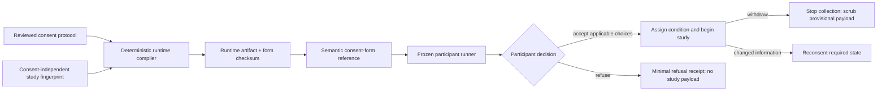

# Stage 3 Phase 10 — Participant Consent Runtime

Status: implemented on August 1, 2026

Scope: bind the exact reviewed Phase 5–8 adult consent artifact into the
participant runner; support local acknowledgement, refusal, withdrawal, and
metadata-minimal receipts without claiming identity, signature, institutional
approval, or legal effectiveness.

## Governing boundary

Phase 10 implements a software control inside a larger human consent process.
It does not decide whether consent is legally effective, whether a waiver is
valid, whether a person has capacity, or whether an institution may launch the
study.

The implementation follows these current authorities and guidance:

- [45 CFR 46.116](https://www.ecfr.gov/current/title-45/subtitle-A/subchapter-A/part-46/subpart-A/section-46.116)
  requires legally effective informed consent before involving a person in
  research, understandable presentation, a real opportunity to discuss and
  consider participation, voluntary choice, and no exculpatory language.
- [OHRP/FDA electronic informed-consent guidance](https://www.hhs.gov/ohrp/regulations-and-policy/guidance/use-electronic-informed-consent-questions-and-answers/index.html)
  treats e-consent as a process rather than a signature screen, requires a
  chance to ask questions and receive a copy, and leaves investigator authority
  and identity/signature requirements outside the software alone.
- [OHRP withdrawal guidance](https://www.hhs.gov/ohrp/regulations-and-policy/guidance/guidance-on-withdrawal-of-subject/index.html)
  distinguishes stopping new intervention/interaction or data collection from
  the protocol-specific handling of information already collected.
- [WCAG 2.2 error prevention for important submissions](https://www.w3.org/WAI/WCAG22/Understanding/error-prevention-legal-financial-data.html)
  informs the review, confirmation, and correction step before the consent
  decision is finalized.

This is an engineering interpretation for product safety, not legal advice.
The applicable IRB or institution still owns the approved process and wording.

## Supported execution envelope

The first runnable envelope is deliberately narrow:

- adult self-consent;
- English (`en-US`);
- reviewed standard adult, survey/information-sheet, interview, or supported
  behavioral form content;
- `electronic-acknowledgement`, or `implied` only when the existing human
  governance and waiver-of-documentation gates are complete;
- local pilot or local production execution through the existing runner and
  Local Research Host;
- main participation plus applicable audio, video, optional-research, and
  recontact decisions.

The runtime fails closed for signed or witnessed processes, FDA-regulated
e-consent, identity proofing, children/assent, parent permission,
LAR/surrogate consent, translated or short-form execution, broad consent, and
external HIPAA/GDPR authorization. Phases 5–8 may author and export those
packages for human review; Phase 10 does not execute them.

## Architecture



The implementation is split into four trust layers:

1. `consentRuntime.ts` compiles and verifies bounded artifacts, creates
   checksum-bound references and receipts, and owns the explicit state machine.
2. `Experiment Studio` schema 9 adds a semantic `consent-form` block. Binding
   removes legacy main/audio/video consent prompts, places the reviewed form
   first, and points recording activities back to its separate decisions.
3. `experimentRunnerPackage.ts` verifies the embedded artifact with browser
   Web Crypto before showing or running the study. No random assignment,
   response, timing, event, trial, checkpoint, microphone, or camera activity
   occurs before a valid acceptance receipt.
4. The generated collector and native Local Host accept `refused` and
   `withdrawn` as distinct states, delete earlier checkpoints and media, scrub
   responses/timings/events/trials, and retain only the metadata-minimal consent
   receipt and operational status.

## Avoiding the checksum cycle

The consent protocol must describe the implemented study, while the Studio must
reference that same protocol. Hashing the reference into its own source would
make a reviewed form stale immediately after binding.

`compileConsentPhase5Source` therefore fingerprints only the
consent-independent study specification. It removes legacy and semantic consent
blocks, normalizes their successors, normalizes recording-consent wiring, and
excludes `updatedAt`. Study procedures, variables, conditions, assignment,
branching, execution controls, trial tables, and timing diagnostics remain in
the fingerprint. A real study change still invalidates consent; binding the
same reviewed form does not.

## Participant flow

The runner presents:

1. the exact reviewed section text and contacts;
2. the form, protocol, and runtime-artifact checksum identities;
3. download/print controls for the participant copy;
4. the main participation decision;
5. each applicable recording or optional-use decision separately and initially
   unselected;
6. a confirmation screen that summarizes every choice and permits correction;
7. a persistent **Stop or withdraw** control after the study starts.

Declining the main study, or a component explicitly configured as required for
the main study, produces `refused` and ends before any study procedure. Declining
an optional component permits the supported study path to continue without
that activity. Recording blocks are skipped unless their corresponding
separate decision was accepted.

## Receipts and state machine

The local receipt records only bounded operational metadata:

- receipt version and checksum;
- session and frozen release identity;
- protocol, runtime artifact, and form checksums;
- language;
- `accepted`, `refused`, `withdrawn`, or `reconsented`;
- whether the decision came from main decline, required-component decline, or
  participant withdrawal;
- applicable separate choices;
- presentation/decision times and optional prior-receipt checksum.

Every receipt states that it is **not** a signature, identity proof, approval,
or legal determination. The state machine permits only:

```text
awaiting-decision -> active | refused
active -> reconsent-required | withdrawn
reconsent-required -> active (matching amended receipt) | withdrawn
```

Refresh recovery accepts an existing receipt only when its release, form, and
artifact identity still match. A stale or altered artifact cannot unlock the
study.

## Withdrawal and deletion semantics

The runtime promise is intentionally precise: withdrawal stops new collection
and scrubs the current provisional local session. The runner and both collector
implementations remove responses, audio/video references, timings, events,
history, and trial data and delete local media for that session.

Cerise does not promise universal deletion of information that was already
committed, de-identified, distributed, or included in analysis. That boundary
comes from the reviewed frozen participant wording and applicable approved
protocol. Phase 10 surfaces that wording; it does not invent a broader right or
retention rule.

## Phase boundary

Phase 10 does not implement analysis-contract schema 2, release/Host bundle
format 6, Stage 4 checksum-bound governance evidence, or the final pilot
candidate. Those remain Phase 11 work and were not changed here.
