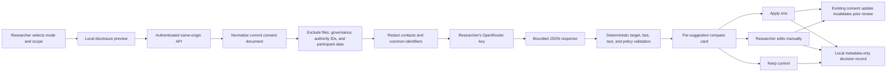

# Stage 3 Phase 9 — Review-before-apply AI consent copilot

Status: implemented on August 1, 2026

Scope: an optional AI advisory layer inside the existing Stage 03 consent
workspace. Phase 9 does not implement participant consent execution,
electronic signatures, refusal/withdrawal runtime, IRB submission, approval,
or release authorization. Those remain outside this phase.

## Outcome

Phase 9 adds a consent copilot that can ask for missing facts, explain one
clause, propose bounded wording for one safe editable clause, compare an
explicit form scope with linked implemented-study facts, and perform a final
advisory review. Every model response passes through a deterministic parser.
Nothing applies until the researcher chooses an action for that individual
suggestion.

The feature is deliberately not part of the consent integrity boundary:

- consent compilation, deterministic validation, human review, versioning,
  and export continue to work when AI is unavailable;
- the assistant cannot set governance, applicability, review state, readiness,
  checksum, approval, or compliance fields;
- the assistant cannot patch absent, cross-form, locked, fill-only,
  conditional, or fact-sensitive clauses;
- applied wording invalidates the clause's prior human-review state through the
  existing deterministic consent update path;
- model output never becomes a participant-facing form merely because it was
  generated.

## Current authority basis

This is product architecture, not legal advice. The design uses the following
current United States sources as authority boundaries, while preserving the
institution's responsibility to determine what applies:

- [45 CFR 46.116](https://www.ecfr.gov/current/title-45/subtitle-A/subchapter-A/part-46/subpart-A/section-46.116)
  requires legally effective consent by the investigator or legally authorized
  representative, understandable language, concise and focused key
  information, sufficient opportunity to decide, and no exculpatory language.
- [45 CFR 46.117](https://www.ecfr.gov/current/title-45/subtitle-A/subchapter-A/part-46/subpart-A/section-46.117)
  assigns documentation and waiver decisions to the applicable IRB process;
  software cannot infer them from form text.
- The joint [HHS OHRP/FDA electronic informed-consent guidance](https://www.hhs.gov/ohrp/regulations-and-policy/guidance/use-electronic-informed-consent-questions-and-answers/index.html)
  says responsibility remains with the investigator even for remote electronic
  consent and cannot be delegated to the electronic system. It also places eIC
  and amendment review with the IRB and calls for understandable, navigable
  materials and an opportunity to ask questions.
- The [NIST AI Risk Management Framework](https://www.nist.gov/itl/ai-risk-management-framework)
  and [NIST Generative AI Profile](https://www.nist.gov/publications/artificial-intelligence-risk-management-framework-generative-artificial-intelligence)
  inform the explicit scope, human oversight, measured failure behavior,
  provenance, privacy, and confabulation controls. NIST AI RMF use is voluntary;
  Cerise does not represent it as certification.

These sources support a three-layer model: deterministic structural checks,
AI advice, and human governance. The AI layer does not collapse the other two.

## Architecture



The browser sends the current normalized consent document only to Cerise's
same-origin server so the server—not an untrusted client—can establish the
allowed target and build external context. OpenRouter receives only the
server-built redacted context and redacted researcher request. Responses use
`private, no-store, max-age=0` and `Pragma: no-cache`.

## Five user modes

| Mode | Default scope | Allowed result |
| --- | --- | --- |
| Missing facts | Selected clause; entire form only by explicit checkbox | Questions and findings; no invented answer |
| Draft clause | One selected clause | At most a bounded proposal for a safe editable clause |
| Explain | One selected clause | Explanation finding and optional safe plain-language alternative |
| Compare | Selected clause; entire form only by explicit checkbox | Contradictions, omissions, and bounded safe wording |
| Advisory review | Selected clause; entire form only by explicit checkbox | Clarity, voluntariness, coercion/exculpation, consistency, burden, optionality, and accessibility findings |

Full-form disclosure is never implied by choosing a mode. The researcher must
select the entire-form checkbox separately. Uploaded files and approval
correspondence are never included by that choice.

## Model input boundary

`createConsentAssistantContext()` builds schema version 1 with:

- the selected form identity and decision mode;
- either one selected clause or the explicitly selected full form;
- only study facts linked to clauses in that scope;
- source locators, edit policies, and human-review state for reasoning context;
- a SHA-256 base-revision checksum used for stale-result detection;
- a redaction count and an explicit list of excluded content.

It excludes:

- participant rows, responses, media, signatures, and receipts;
- authority file contents and uploaded institutional files;
- approval correspondence;
- governance and waiver decisions;
- authority and institution identifiers.

The redactor replaces common email addresses, telephone numbers, street
addresses, titled personal names, signature lines, and IRB/protocol-style
identifiers. Contact and signature clauses are replaced wholesale. The UI also
warns researchers not to paste participant data. Redaction is risk reduction,
not a guarantee that arbitrary free text contains no identifying information.

## Response and apply boundary

The model can return only four suggestion kinds:

```ts
type ConsentAssistantSuggestion =
  | ConsentClausePatchSuggestion
  | ConsentPlainLanguageAlternative
  | ConsentFinding
  | ConsentQuestion;
```

The parser establishes current wording from server context; it ignores any
model-supplied `currentText`. It rejects:

- unknown suggestion kinds, forms, clauses, or study-fact references;
- any patch outside the selected form and selected clause scope;
- patches to locked, fill-only, conditional, or absent clauses;
- patches to risks, benefits, alternatives, contacts, costs, compensation,
  injury, privacy/confidentiality, withdrawal, retention, sharing, specimen,
  genetic, broad-consent, surrogate, guardian, assent, signature, waiver, or
  deception content;
- approval/compliance claims, exculpatory or coercive language, absolute
  privacy promises, direct contact values, institutional IDs, HTML, oversized
  text, and new placeholders;
- more than eight suggestions.

Rejected suggestions are counted for the researcher but never exposed as
applicable actions. There is no bulk-apply operation.

Before an individual apply action, the browser recomputes the same scoped
revision checksum. If the form changed after generation, apply fails closed and
the researcher must run a new review. Accepted wording flows through
`updateConsentPhase5Clause()`, which clears exports and requires renewed human
review according to the clause's existing edit policy.

`Edit manually` is a distinct researcher action. It starts from proposed
wording but the submitted text is treated as a direct researcher edit and is
still processed by deterministic consent validation.

## Decision ledger

Phase 9 stores a bounded, project-scoped local ledger of up to 200 decisions.
Each record contains:

- suggestion ID, kind, title, mode, form, and optional clause target;
- `applied`, `applied-after-edit`, or `kept-current` action;
- decision time, base revision checksum, proposed/resulting text checksums, and
  served-model identifier;
- an explicit claim that this is a researcher decision record, not AI approval
  or governance.

The ledger does not store prompts, chat history, complete proposed wording, or
complete resulting wording. Consent content itself remains in the existing
consent document and its normal local/cloud persistence path.

## Endpoint controls

`/api/ai/consent-assistant` is:

- authenticated and same-origin JSON only;
- project-owner checked before inference;
- BYOK-only through the user's encrypted OpenRouter credential, with no Cerise
  fallback key;
- protected by per-minute and daily request caps;
- blocked for a paid model until the OpenRouter key has a USD spending limit;
- blocked when the configured spending limit is exhausted;
- routed through the shared AI guardrail and metadata-only usage accounting;
- bounded to a 180 KiB request, 1,500-character researcher instruction,
  3,500-token model response, low temperature, and 55-second timeout;
- free of saved conversation history.

Usage accounting records user, project, feature, lane, model, token usage, and
cost metadata through the existing service. It does not record consent text or
assistant output.

## UX behavior

The copilot appears under Form and Review & export as a collapsed optional
workbench. Opening it shows:

1. one task selector rather than an open-ended chatbot;
2. the selected form/clause scope;
3. an explicit entire-form checkbox only for modes that support it;
4. a disclosure of clause/fact counts, exclusions, redactions, provider, and
   scoped checksum;
5. BYOK connection state and a settings link when missing;
6. current/proposed wording, fact references, rationale, uncertainty, and
   potential conflicts for each suggestion;
7. separate Apply, Keep current, and Edit manually actions.

Applied suggestions do not show “approved,” “valid,” or “ready.” The workspace
instead explains that wording requires renewed human review.

## Code map

- `src/lib/research/consentAssistant.ts` — schemas, redaction, context,
  normalization, response parser, revision identity, and decision ledger.
- `src/app/api/ai/consent-assistant/route.ts` — authenticated BYOK inference
  boundary, spending controls, no-store response, and metadata-only usage.
- `src/components/research-path/ConsentAssistantPanel.tsx` — disclosure,
  bounded modes, result comparison, explicit actions, stale check, and ledger.
- `src/components/research-path/ConsentAssistantPanel.module.css` — responsive
  consent-workspace visual system and reduced-motion behavior.
- `src/lib/research/consentAssistant.test.ts` — adversarial and lifecycle tests.

## Deferred to later approved phases

Phase 9 does not build:

- participant acceptance, refusal, correction, withdrawal, or receipt runtime;
- identity proofing or legally regulated electronic signatures;
- consent-to-study binding in the runnable experiment;
- release-format 6, verified contract, Stage 04 approval binding, or Local Host
  verification;
- AI translation promotion or qualified language review;
- legal, IRB, clinical, or ethical determinations.

Those boundaries preserve Phase 10 and Phase 11 as separately approvable work.
