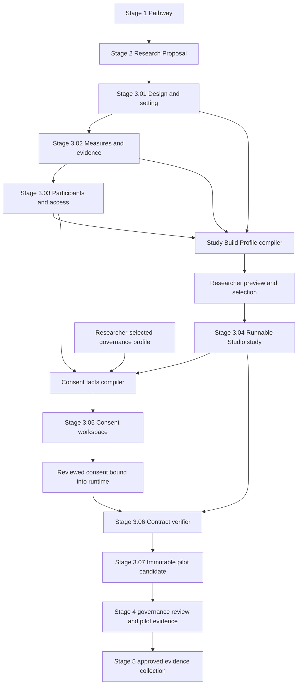
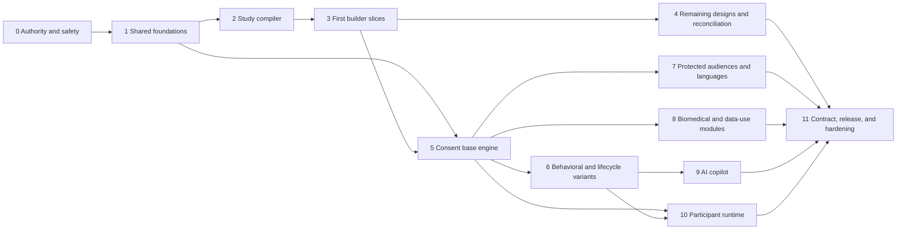

# Stage 3 — Study Builder and Consent Implementation Plan

Status: proposed; awaiting phase-by-phase implementation approval

Research review date: July 31, 2026

Scope: implementation sequence for the generative study builder, design and
setting variants, consent and assent form families, AI assistance, participant
runtime, contract verification, and pilot-candidate release gates

Product code changed by this plan: none

Companion architecture:

- [Generative Study Builder and Dependency Architecture](./stage-3-generative-study-builder-architecture.md)
- [Consent and Participant Rights Architecture](./stage-3-consent-and-participant-rights-architecture.md)
- [Verified Study Contract and Pilot Candidate Architecture](./stage-3-contract-and-pilot-release-architecture.md)

Visual architecture board:
[Cerise Scholar Stage 3 Architecture](https://www.figma.com/board/PjKGE6Rt5mivhrKs7wq9ub)

## Executive recommendation

Build Stage 3 as two deterministic compilers joined by one verified artifact
pipeline:

1. The **Study Build Profile compiler** converts the selected design, setting,
   measures, and participant plan into proposed runnable modules, variables,
   execution requirements, and honest capability findings.
2. The **Consent Protocol compiler** reads the accepted runnable study plus a
   researcher-selected governance profile and composes the applicable consent
   form families, audience variants, documentation process, and procedure
   modules.
3. The researcher reviews every generated change. AI may explain and draft
   editable content, but neither compiler depends on AI and neither AI nor
   Cerise decides which law, review category, waiver, or institution policy
   applies.
4. The reviewed consent artifact is bound into the participant flow before
   contract verification and export.
5. A pilot candidate freezes the exact design, Studio document, consent forms,
   contract, overrides, source-template identities, and checksums reviewed in
   Stage 4.

The recommended visible order remains:

| Step | Name | Responsibility |
| --- | --- | --- |
| 01 | Select Design | Choose the methodological design, setting, and rationale |
| 02 | Map Measures | Define research questions, constructs, evidence, and variables |
| 03 | Plan Participants | Define population, sampling, assignment, access, and devices |
| 04 | Build Study | Compile, preview, accept, and edit a design-specific runnable study |
| 05 | Design Consent and Participant Rights | Compose applicable forms, review them, and bind them to the runtime |
| 06 | Verify Data and Analysis Contract | Reconcile intent, procedure, consent, variables, and planned analysis |
| 07 | Create Pilot Candidate | Rehearse, freeze, checksum, version, and export the pilot-ready package |

Consent belongs after Build Study because it must describe the procedure that
participants will actually experience. It belongs before Verify Contract and
Create Pilot Candidate because consent is part of the contract and must be in
the runnable experiment before export.

## Safety and product boundary

Cerise is a consent-authoring, study-consistency, and release-integrity tool. It
is not an IRB, legal service, ethics board, medical authority, or compliance
certificate.

The system must distinguish four decisions:

| Decision | Owner | What Cerise may do |
| --- | --- | --- |
| Is this human-subjects research and which review path applies? | Researcher and applicable institution/IRB | Ask structured questions, show declared status, and block unresolved required fields |
| Which approved institutional template and wording apply? | Researcher and applicable institution/IRB | Import/version templates and enforce their editing policies |
| Does the consent accurately describe the implemented study? | Cerise deterministic verifier plus researcher review | Compare artifacts, report mismatches, and block release |
| Is the study ethically and operationally approved to pilot or collect? | Stage 4 human governance plus Local Research Host readiness | Bind evidence to immutable checksums; never self-approve |

Cerise must never infer `exempt`, `waiver approved`, `parental permission
waived`, `surrogate authorized`, `FDA compliant`, or `IRB approved` merely from
a selected design. A cross-sectional survey, for example, may be exempt,
expedited, or otherwise governed depending on participants, identifiability,
content, procedures, institution, and jurisdiction.

## Research basis

### What the current UCSF materials establish

The current UCSF Human Research Protection Program separates **form family**
from **study procedure**:

- Beginning July 1, 2026, UCSF directs new full-committee and expedited studies
  to its 2026 Plain Language Consent Form Template and Companion. One core
  template supports many biomedical and social/behavioral study types, while
  conditional sections and approved wording vary with the study.
- UCSF maintains separate exempt templates for anonymous and confidential
  surveys, education surveys, focus groups, interviews, and verbal scripts.
- UCSF maintains separate telephone-consent, eligibility-screening,
  non-English short-form, assent, parental-permission, addendum, expanded-access,
  and other specialized materials.
- The 2026 template organizes key information first, followed by procedures,
  risks, payment/reimbursement, information and specimen use, privacy,
  injury/costs, withdrawal, rights, contacts, signatures, and optional research
  where applicable.
- The Companion distinguishes institution-protected wording from researcher
  fields and conditional choices. Some language may not be altered, some fields
  may only be filled, and other study-specific sections are editable.
- UCSF's age examples use developmentally appropriate assent and parental
  permission, but the governing decision remains study- and jurisdiction-
  specific.
- A waiver of signed documentation is not a waiver of the consent process.
- Deception or incomplete disclosure requires the applicable human review and
  generally a debrief plan; audio/video recording must be described along with
  use and retention.

These findings support a **form-family compiler**, not one giant template and
not one hard-coded form per design option.

Primary UCSF sources:

- [Consent and Assent Form Templates](https://irb.ucsf.edu/consent-and-assent-form-templates)
- [Exempt Consent Templates and Guidance](https://irb.ucsf.edu/exempt-consent-templates-and-guidance)
- [Consent Guidelines](https://irb.ucsf.edu/consent-guidelines)
- [Children and Minors in Research](https://irb.ucsf.edu/children-and-minors-research)
- [Consenting Non-English Speakers](https://irb.ucsf.edu/consenting-non-english-speakers)
- [Obtaining and Documenting Informed Consent without Signatures](https://irb.ucsf.edu/verbal-electronic-or-implied-consent-waiver-signed-consent)
- [Social and Behavioral Research](https://irb.ucsf.edu/social-and-behavioral-research)
- [Surrogate Consent](https://irb.ucsf.edu/surrogate-consent)
- [Cognitive Impairments and Decisional Capacity](https://irb.ucsf.edu/enrolling-individuals-cognitive-impairments-and-assessing-decisional-capacity)
- [De-identification and Confidentiality of Research Data](https://irb.ucsf.edu/content/de-identification-and-confidentiality-of-research-data)

### What federal sources establish

The Common Rule and FDA rules provide a regulatory baseline when they apply;
they are not a universal jurisdiction selector.

- [45 CFR 46.116](https://www.ecfr.gov/current/title-45/subtitle-A/subchapter-A/part-46/subpart-A/section-46.116)
  requires key information first and specifies basic and conditional elements
  of consent. It also defines IRB findings for waiver or alteration and the
  elements of broad consent.
- [45 CFR 46.117](https://www.ecfr.gov/current/title-45/subtitle-A/subchapter-A/part-46/subpart-A/section-46.117)
  covers documentation, copies, short-form presentation, witnesses, and IRB
  waiver of signed documentation.
- [45 CFR 46.408](https://www.ecfr.gov/current/title-45/subtitle-A/subchapter-A/part-46/subpart-D/section-46.408)
  covers parental permission and child assent when Subpart D applies.
- [21 CFR 50.25](https://www.ecfr.gov/current/title-21/chapter-I/subchapter-A/part-50/subpart-B/section-50.25)
  defines consent elements for FDA-regulated clinical investigations when it
  applies.
- [Joint OHRP/FDA electronic informed-consent guidance](https://www.hhs.gov/ohrp/regulations-and-policy/guidance/use-electronic-informed-consent-questions-and-answers/index.html)
  treats eConsent as an ongoing process that must support understanding,
  questions, navigation, copies, amendments, and appropriate documentation.
- [OHRP Consent Form Checklist](https://www.hhs.gov/ohrp/consent-form-check-list.html)
  emphasizes common language, readable presentation, headings, and short
  sentences rather than relying on a readability score alone.
- [NIH IRB Consent Templates](https://irbo.nih.gov/nih-irb-templates/consent-templates/)
  provide a second current institutional example of core consent, assent,
  addenda, and specialized libraries.

### Product conclusions from the research

1. **One study can require multiple artifacts.** Adult consent, parental
   permission, assent, recording choice, optional sub-study, translated form,
   short-form process, and reconsent addendum cannot be flattened into one yes/no
   screen.
2. **Review path, participant audience, documentation, and procedure are
   independent axes.** They combine into the required form set.
3. **Institution policies are versioned profiles.** UCSF-specific rules must not
   become universal Cerise rules.
4. **Protected wording needs code-enforced edit policy.** Source provenance and
   template checksums are part of the release.
5. **Consent is a process.** The runner must support refusal, questions,
   accessible reading, separate optional decisions, copies, reconsent, and
   withdrawal behavior—not only display a document.
6. **AI output is draft content.** Deterministic coverage and consistency checks
   remain authoritative; human approval remains external.

## Connected architecture



The connection is bidirectional during authoring. If Build Study changes the
duration, recording, randomization, data fields, risk-bearing procedure, or
withdrawal behavior, the consent source fingerprint becomes stale. If consent
disallows required recording or describes a different procedure, the contract
reports the mismatch and sends the researcher to the correct repair target.

## Study-design capability architecture

### Do not make eight monolithic templates

The existing eight design choices are useful methodological labels, but a
runnable study depends on more than `selectedDesign`. The builder should compile
an explicit capability profile across these axes:

| Axis | Example values | Why it changes the build |
| --- | --- | --- |
| Methodological design | randomized-between, within-subjects, quasi-experimental, survey, longitudinal, observational, qualitative, mixed-methods | Determines evidence structure and methodological validators |
| Setting | online/home, laboratory, field, hybrid | Determines device, support, privacy, interruption, and rehearsal requirements |
| Interaction | self-administered, researcher-led, group, observer-entered | Determines navigation, handoff, privacy, and consent process |
| Assignment | none, random, stratified, counterbalanced, naturally occurring | Determines conditions, allocation, concealment, and balance checks |
| Time | one session, repeated blocks, multiple waves, event-triggered | Determines checkpointing, identity/recontact, attrition, and reconsent needs |
| Evidence modality | survey, task performance, interview, focus group, observation, media, sensor, specimen | Determines blocks, variables, storage, consent modules, and runtime capability |
| Intervention | none, behavioral manipulation, educational intervention, clinical/drug/device | Determines procedural disclosures, risks, alternatives, and governance profile |
| Disclosure | full, incomplete disclosure proposed, deception approved | Determines consent alteration status and debrief path |
| Data sensitivity | anonymous, coded, identifiable, PHI, genetic, audio/video | Determines confidentiality, retention, access, and future-use modules |
| Audience | adult, child, guardian, LAR/surrogate, language/access variant | Determines form family and execution limits |

`selectedDesign` supplies the primary methodological module. Other axes add,
remove, or constrain modules. This avoids a brittle Cartesian product such as
“online randomized adolescent video-recorded longitudinal experiment template.”

### Current design options and target generated behavior

| Selected design | Required scaffold capabilities | Main checks | Example consent facts—not review-path decisions |
| --- | --- | --- | --- |
| Randomized between-groups | conditions, allocation, condition-specific procedure, shared outcomes, assignment audit | ratio, balance, contamination, manipulation, comparable measures | assignment by chance, condition differences, placebo/control where applicable |
| Within-subjects | repeated conditions, order/counterbalance, washout/breaks, repeated outcome identity | order effects, carryover, fatigue, missing condition data | repeated procedures, duration, burden, condition risks |
| Quasi-experimental | existing groups/intervention exposure, comparison logic, covariates, timing | confounding, baseline comparability, assignment claim prevention | group source, procedures, no false claim of randomization |
| Cross-sectional survey | sections, validated/self-authored measures, skip logic, optional sensitive items, submission | missingness, response burden, mobile/reflow, anonymous-versus-confidential claims | survey topics, time, discomfort, identifiability, skip/stop rights |
| Longitudinal | waves, stable measure identity, recontact, reminders, attrition/withdrawal | scheduling, identity linkage, version drift, partial-wave handling | number/timing of contacts, recontact, retention, new-information/reconsent plan |
| Observational | event/behavior coding, context, timestamps, observer workflow | privacy expectation, third parties, inter-rater reliability, identifiability | observation setting, notice/consent status, recording and privacy limits |
| Qualitative | interview/focus-group/diary modules, probes, participant-controlled skip/pause, transcript plan | recording choice, group confidentiality limits, quote policy, saturation rationale | topics, recording/use/destruction, quotations, emotional discomfort |
| Mixed methods | named quantitative and qualitative lanes plus integration metadata | construct identity, sample linkage, sequence, priority, integration completeness | every procedure and modality, linkage, recording, optional sub-study boundaries |

These are scientific starting requirements, not complete protocols. The user
previews guided, minimal-compatible, and blank-with-requirements choices before
anything is materialized.

### Setting overlays

| Setting | Builder behavior |
| --- | --- |
| Online/home | responsive controls, checkpoint/recovery, realistic browser/device support, privacy-on-shared-device guidance, participant exit/support access, no default fullscreen/focus monitoring |
| Laboratory | researcher setup/handoff, equipment/calibration, latency checks where justified, session reset, room/device rehearsal, assisted refusal/withdrawal path |
| Field | offline/interruption limits, environment and bystander privacy, device battery/storage, permission checks, safety and minimal location collection |
| Hybrid | shared core plus explicit setting branches, comparable measure identity, per-setting consent facts and rehearsals, named deviations rather than generic defaults |

Setting changes the implementation. It does not automatically change the
methodological design or determine the consent review category.

### Core profile model

```ts
type StudyBuildProfile = {
  schemaVersion: 1;
  sourceFingerprint: StudyBuildSourceFingerprint;
  design: StudyDesignKind;
  setting: StudySetting;
  capabilities: StudyCapabilitySelection[];
  modules: StudyBuildModuleRecommendation[];
  variables: ExperimentVariableProposal[];
  evidenceMappings: StudyEvidenceMapping[];
  requiredChecks: StudyBuildCheck[];
  capabilityFindings: StudyCapabilityFinding[];
  conflicts: StudyBuildConflict[];
  rationale: StudyBuildRationale[];
};

type StudyCapabilityStatus =
  | "supported"
  | "supported-with-limits"
  | "authoring-export-only"
  | "unsupported";
```

The compiler is pure and deterministic. The same normalized source must produce
the same profile and checksum in tests, the browser, Local Host, imports, and
release verification.

## Consent form-family architecture

### Composition axes

The consent compiler selects and composes across five independent axes:

1. **Governance family:** not yet determined, institution-documented exempt,
   expedited/full standard, FDA-regulated, or another institution profile.
2. **Decision-maker/audience:** adult participant, parent/guardian, child or
   adolescent assent, legally authorized representative/surrogate, or
   accessible/language variant.
3. **Documentation process:** signed written/eConsent, verbal, electronic
   acknowledgement, implied consent, telephone script, short-form oral process
   with witness/summary, or IRB-approved waiver/alteration.
4. **Study/procedure modules:** survey, interview, focus group, randomization,
   deception/debrief, recording, intervention, imaging, specimens/genetics,
   future use, recontact, and other declared capabilities.
5. **Lifecycle artifacts:** initial consent, screening consent, optional
   sub-study, new-information addendum/reconsent, withdrawal information, and
   translated versions.

The researcher or institution selects the governance and approval facts. Cerise
derives procedure facts from the accepted Studio document and reports conflicts.

### Consent families Cerise should support

| Research situation | Base artifact family | Conditional modules or related artifacts | Initial execution posture |
| --- | --- | --- | --- |
| Anonymous one-time survey | Exempt information/consent sheet where institutionally applicable | purpose, time, topics, voluntary skip/stop, anonymity limits, contacts; implied decision only when declared approved | MVP runtime |
| Confidential survey | Exempt or standard form selected by researcher | collected identifiers, access, storage, retention, breach risk, withdrawal boundary | MVP runtime |
| Interview | Exempt or standard form selected by researcher | sensitive topics, pause/skip, recording, transcription, quotes, retention | MVP runtime |
| Focus group | Exempt or standard form selected by researcher | recording plus explicit limits on guaranteeing other participants' confidentiality | MVP runtime after group-flow support |
| Minimal-risk behavioral experiment | Standard or institution-determined exempt form | randomization, task risks, incomplete disclosure status, debrief, performance/event logging | MVP runtime for adult English forms |
| Deception/incomplete disclosure | IRB-reviewed consent alteration plus debrief artifact | declared approval reference, concealed-fact boundary, debrief timing, post-debrief decision if required | Authoring/export first; runtime only after gate design |
| Telephone screening | Screening script distinct from main-study consent | eligibility questions, sensitive screening data, retention/deletion, transition to main consent | Later runtime |
| Telephone main study | Telephone script/process | identity/question opportunity, documentation, copy/information delivery | Later runtime |
| Longitudinal/recontact | Standard form plus lifecycle policy | waves, reminders, identity linkage, changes/new findings, reconsent triggers | Later runtime |
| Audio/video research | Separate or clearly separable recording decision | purpose, required/optional status, uses, access, retention/destruction, teaching/public use boundaries | MVP for optional audio/video decisions |
| Child/adolescent research | Parent/guardian permission plus age/development-appropriate assent | one/two-parent rule declared from institution, dissent handling, reconsent at age of majority where applicable | Authoring/export first |
| Decisional-capacity concern | Adult/LAR/surrogate forms and capacity plan | assessment, authority basis, participant involvement/assent, reconsent if capacity changes | Authoring/export first |
| Non-English participant | Fully translated reviewed form or approved short-form process | interpreter, witness, summary, version alignment, copy, reviewer identity | Authoring/export first |
| Biomedical/clinical investigation | Standard/FDA/institution profile | experimental procedures, risks, alternatives, injury, costs, drugs/devices/placebo, clinical-trial statements | Specialized later phase |
| Biospecimen/genetic research | Standard form plus data/specimen modules | future use, commercial profit, result return, whole-genome sequencing, sharing, identifiability | Specialized later phase |
| Broad consent | Dedicated regulatory family when applicable | storage/maintenance, secondary research, identifiable data/specimens, scope and period | Specialized later phase; never a generic checkbox |
| New information after enrollment | Addendum or revised consent/reconsent | affected participants, change summary, continued participation decision, new checksum | Later lifecycle support |

The table is a capability catalog, not a determination engine. Selecting
“anonymous survey” may recommend an exempt-template option, but the researcher
must supply the institution's determination or choose `not-yet-determined`.

### Template authority and clause policy

```ts
type ConsentTemplateAuthority = {
  id: string;
  institution: string;
  jurisdiction: string;
  family: ConsentTemplateFamily;
  sourceUrl: string;
  sourceName: string;
  sourceVersion: string;
  effectiveDate: string | null;
  retrievedAt: string;
  sourceChecksum: string;
  usageNotes: string;
};

type ConsentClauseEditPolicy =
  | "locked"
  | "fill-only"
  | "editable"
  | "conditional"
  | "institution-review-required";

type ConsentClauseDefinition = {
  id: string;
  purpose: ConsentClausePurpose;
  authorityId: string;
  policy: ConsentClauseEditPolicy;
  applicabilityRuleId: string | null;
  sourceText: string;
  allowedPlaceholders: string[];
};
```

Rules:

- Imported institutional files remain provenance attachments with filename,
  source URL, version, retrieval date, and checksum.
- The source text is not silently rewritten during import.
- AI cannot patch `locked` content and may only fill declared placeholders in
  `fill-only` clauses.
- Conditional clauses require a recorded applicability choice and rationale.
- A template update never mutates an approved form. It creates a source-update
  reconciliation task and a new version after researcher review.
- UCSF rules stay in a UCSF profile. Other institutions can supply their own
  authority packs without changing the core domain model.

### Consent build profile

```ts
type ConsentBuildProfile = {
  schemaVersion: 1;
  projectId: string;
  sourceFingerprint: ConsentSourceFingerprint;
  governance: ConsentGovernanceDeclaration;
  authority: ConsentTemplateAuthority | null;
  participantGroups: ConsentParticipantGroup[];
  requiredFormFamilies: ConsentFormRequirement[];
  procedureModules: ConsentProcedureModule[];
  lifecycleArtifacts: ConsentLifecycleRequirement[];
  contradictions: ConsentContractFinding[];
  readiness: ConsentReadiness;
};

type ConsentGovernanceDeclaration = {
  pathway:
    | "not-yet-determined"
    | "documented-exempt"
    | "expedited-or-full"
    | "fda-regulated"
    | "other-institutional";
  decisionSource: "researcher" | "institution";
  institutionReference: string;
  waiverOrAlteration: {
    status: "not-requested" | "requested" | "approved" | "denied";
    approvalReference: string;
  } | null;
  documentationMethod: ConsentDocumentationMethod;
};
```

Readiness is always derived. A stored checkbox cannot make an unresolved waiver,
stale source, missing audience form, or contradictory procedure ready.

### AI boundary

The AI consent assistant may:

- explain why a module is present;
- ask the researcher for missing study-specific facts;
- propose plain-language alternatives for editable clauses;
- draft a new editable section from researcher-provided facts;
- compare a draft semantically with the implemented procedure;
- flag ambiguous, coercive, exculpatory-sounding, overly technical, or
  inconsistent language for human review;
- summarize changes before reconsent.

The AI consent assistant may not:

- select the legal jurisdiction, IRB path, exemption, waiver, or approving body;
- mark a form approved, compliant, valid, or ready;
- edit locked institutional text;
- invent risks, benefits, alternatives, injury terms, contacts, or approval IDs;
- translate a form into an execution-ready reviewed variant;
- see participant responses or media;
- bulk-apply suggestions or alter the runnable study without explicit review.

## Delivery phases

Each phase is an independently approvable pull request series. A later phase
does not begin until the prior phase's exit gate is met. The labels below are
implementation phases for this Stage 3 program; they do not renumber Cerise's
product stages.

### Phase 0 — Authority registry and safety boundary

**Goal:** establish trustworthy sources, product claims, and template policies
before building form generation.

Build:

- `ConsentTemplateAuthority`, `ConsentTemplateFamily`, and
  `ConsentClauseEditPolicy` schemas;
- a bundled generic research profile and a versioned UCSF 2026 profile manifest
  that references official sources without presenting Cerise as UCSF-approved;
- source URL, version, effective date, retrieval date, checksum, and update-state
  handling;
- capability flags that separate authoring/export from executable consent;
- UI language for `not yet determined`, `researcher declared`, `institution
  documented`, and `human review required`;
- a licensing/use review gate before redistributing any full institutional
  template text in the application.

Tests:

- manifest schema and checksum stability;
- duplicate/unknown authority rejection;
- clause policy enforcement fixtures;
- stale template detection without automatic mutation;
- claim-language tests that prevent “IRB approved” or “legally compliant”
  product assertions.

Exit gate:

- Every rule can identify its source and profile version.
- Institution-specific rules do not leak into the generic profile.
- Cerise can represent uncertainty without guessing.
- Redistribution permission is documented before institutional source text is
  shipped; otherwise only metadata, structure, and user-import flow ship.

### Phase 1 — Shared compiler and artifact foundations

**Goal:** create the deterministic substrate used by both Study Build and
Consent.

Build:

- stable source references and semantic IDs;
- canonical normalization and checksum utilities;
- pure compile/diff/apply-preview interfaces;
- persisted researcher decisions versus recomputed derived views;
- common issue shape with `blocking`, `warning`, and `advisory` severity plus
  a concrete repair target;
- non-destructive schema migrations and bounded import normalization;
- artifact dependency graph and invalidation events.

Proposed modules:

- `src/lib/research/artifactIdentity.ts`;
- `src/lib/research/studyBuildProfile.ts`;
- `src/lib/research/consentProtocol.ts`;
- `src/lib/research/researchArtifactGraph.ts`.

Tests:

- idempotent compilation and canonical serialization;
- stable IDs through display-order changes;
- malformed, oversized, duplicate, and unknown imported fields;
- source change → expected downstream invalidation;
- old drafts remain readable and are not silently rewritten.

Exit gate:

- The same inputs always produce the same derived output and checksum.
- No derived `ready` boolean is persisted as authority.
- Every issue points to the artifact the researcher can repair.

### Phase 2 — Study-design capability compiler

**Goal:** make selected design and setting materially control the proposed
runnable-study architecture.

Build:

- `StudyDesignModuleRegistry` for the eight existing design options;
- `StudySettingModuleRegistry` for online, laboratory, field, and hybrid;
- measure, participant, assignment, accessibility, and runtime-capability
  registries;
- composition, deduplication, precedence, conflict, and capability reporting;
- guided, minimal-compatible, and blank-with-requirements profile variants;
- explicit `supported`, `supported-with-limits`, `authoring-export-only`, and
  `unsupported` states;
- source/rationale evidence for every recommendation.

Tests:

- all 32 design × setting pairs compile deterministically;
- each design has required methodological modules and validators;
- qualitative work is not forced into quantitative outcome fields;
- mixed methods preserves separate lanes and integration metadata;
- unsupported capabilities fail closed with bounded alternatives.

Exit gate:

- Every current option has an honest profile even if the runtime cannot yet
  execute it.
- No AI call is needed to produce or verify a profile.
- Online survey and laboratory experiment profiles are already structurally
  different before any UI materialization.

### Phase 3 — First two end-to-end Study Builder slices

**Goal:** validate the architecture with two deliberately contrasting studies.

Slice A: **cross-sectional survey + online/home**

- welcome and support;
- later-bound structured consent reference;
- responsive survey sections and skip logic;
- optional sensitive/demographic items;
- checkpoint/interruption behavior;
- submit/debrief;
- mobile, shared-device privacy, burden, and accessibility checks.

Slice B: **randomized between-groups experiment + laboratory**

- welcome and researcher handoff;
- later-bound structured consent reference;
- lab/equipment instructions;
- allocation and condition routing;
- condition task/trials;
- manipulation and outcome measures;
- debrief and session reset;
- assignment, timing, equipment, and rehearsal checks.

UI:

- Study Build Profile summary;
- “Why this module?” source trace;
- semantic preview diff;
- explicit accept/modify/decline/defer per recommendation;
- `Create study draft` only after selection;
- no regeneration over an existing Studio document.

Exit gate:

- Both slices create materially different, usable starting studies.
- The researcher sees and approves the exact diff before persistence.
- Existing Studio work is never silently overwritten.
- Unit, component, and browser tests cover both happy and refusal paths.

### Phase 4 — Reconciliation and remaining design/setting modules

**Goal:** cover the full current option set and make upstream changes safe.

Build:

- within-subjects, quasi-experimental, longitudinal, observational, qualitative,
  and mixed-method modules;
- field and hybrid execution branches;
- stable `StudioSourceLink`, accepted recommendation IDs, and researcher
  overrides;
- source-change detection and semantic reconciliation;
- selective apply, keep-with-rationale, and rebuild-as-new-draft actions;
- capability-limit presentation for longitudinal identity/scheduling, advanced
  sensors, offline execution, or other not-yet-runnable features.

Tests:

- source changes preserve manual blocks and stable semantic IDs;
- design change updates only selected recommendations;
- hybrid paths declare shared versus setting-specific procedures;
- longitudinal plans cannot claim runnable follow-up without supported identity,
  scheduling, and recontact capabilities;
- no false claim of randomization in quasi-experimental flows.

Exit gate:

- Every design and setting option has tested materialization or a clear bounded
  capability result.
- Changing Steps 01–03 produces a reviewable diff and never destructive
  regeneration.

### Phase 5 — Consent authority, fact compiler, and base workspace

**Goal:** implement consent as structured, versioned artifacts before adding AI
or participant execution.

Build:

- governance declaration and authority selection;
- template import with source attachment/checksum;
- clause policy enforcement;
- deterministic facts extracted from design, participant plan, and actual Studio
  procedure;
- participant groups, form requirements, procedure modules, lifecycle artifacts,
  data practices, and withdrawal plan;
- structured composer, side-by-side source facts, participant preview, issue
  center, and review history;
- source fingerprint and stale-state reconciliation;
- adult English standard-form and exempt-form structural profiles.

Initial authored families:

- adult standard plain-language consent;
- anonymous online survey information/consent;
- confidential online survey information/consent;
- adult interview consent;
- separate optional audio and video recording choices.

Tests:

- missing duration, procedure, risk/discomfort, privacy, contact, or withdrawal
  facts become issues based on the selected profile;
- locked/fill-only clauses reject unauthorized patches;
- anonymous claims conflict with identifiers, contact fields, or linkable
  receipts;
- recording facts produce separate decisions and retention/use fields;
- template updates create reconciliation instead of mutation.

Exit gate:

- Researchers can author, import, reconcile, preview, version, and export the
  initial families without editing JSON.
- Every clause is traceable to authority, study fact, researcher, or AI draft.
- No form is represented as institutionally approved.

### Phase 6 — Behavioral, remote, and lifecycle consent variants

**Goal:** cover the common social/behavioral cases that change participant flow.

Build:

- focus-group confidentiality module;
- behavioral randomization and task-risk modules;
- incomplete-disclosure/deception declaration with approval-reference gate;
- debrief artifact and debrief-delivery state;
- telephone eligibility-screening versus telephone main-study families;
- waiver-of-signed-documentation status without confusing it with waiver of
  consent;
- longitudinal recontact, changed-information addendum, and reconsent triggers;
- optional sub-study decisions that remain independent of main-study consent;
- recording use, access, retention/destruction, teaching/public-use boundaries.

Tests:

- deception cannot be enabled by selecting an experiment design;
- unapproved/requested waiver or alteration remains blocking;
- debrief cannot be omitted from a declared applicable flow without a recorded
  human determination;
- declining an optional recording or sub-study does not decline the main study
  when the protocol permits non-recording participation;
- focus-group copy never promises confidentiality that other participants
  cannot guarantee;
- screening data follows its own retention/deletion contract.

Exit gate:

- Common adult social/behavioral families can be authored and verified against
  the procedure.
- Higher-governance flows remain authoring/export-only until their runtime
  prerequisites are approved.

### Phase 7 — Protected audiences, languages, and specialized governance

**Goal:** add structurally correct multi-form packages without overstating
execution validity.

Build:

- parental/guardian permission;
- developmentally appropriate assent families and dissent handling;
- LAR/surrogate form and decisional-capacity plan;
- accessible oral-presentation/witness documentation fields;
- fully translated variant workflow with qualified-review state;
- short-form oral consent package with summary, interpreter/witness, source and
  target language, and version alignment;
- institution-profile fields for one/two-parent rules, short-form limits, local
  contacts, and other jurisdiction-specific policies.

Execution boundary:

- Cerise may author, review, freeze, and export these packages.
- Multi-actor execution remains disabled until identity, authority ordering,
  signatures/documentation, witness presence, and receipt custody have an
  approved threat and legal-process design.

Tests:

- the required audience set is complete for the researcher-declared profile;
- assent and parent permission remain distinct artifacts;
- form versions/languages cannot drift independently;
- an AI translation cannot become `human-reviewed`;
- no universal age, parent-count, surrogate, or short-form rule is hard-coded
  outside its institution profile.

Exit gate:

- Specialized form packages are structurally complete and exportable for human
  review.
- The UI clearly distinguishes authoring support from legally effective runtime
  execution.

### Phase 8 — Biomedical, clinical, specimen, and data-use modules

**Goal:** add the highest-complexity conditional content after the base engine
and governance model are proven.

Build:

- experimental procedure, drug, device, placebo/randomization, imaging,
  radiation, sedation, reproductive, injury, cost, and alternatives modules;
- reportable-result and clinically relevant result-return choices;
- tissue/specimen, genetic testing, genome sequencing, data sharing, future use,
  commercial profit, and optional-research modules;
- dedicated broad-consent family rather than a generic future-use checkbox;
- FDA-regulated profile and explicit external e-signature/21 CFR Part 11
  integration boundary;
- PHI/HIPAA and GDPR as institution-controlled addenda/integrations, not
  universal text generated by Cerise.

Tests:

- conditional modules activate from declared procedures and governance, not
  keywords alone;
- required injury/cost/alternatives clauses cannot be silently removed;
- specimen/data-only options do not contradict Studio collection and sharing;
- broad consent cannot be selected as ordinary optional future use;
- Cerise does not represent its local acknowledgement receipt as a compliant
  regulated electronic signature.

Exit gate:

- Specialized forms compile with source-policy protection and complete
  procedure mappings.
- Runtime remains disabled for any path whose external identity/signature or
  institutional integration is not implemented and validated.

### Phase 9 — Review-before-apply AI copilot

**Goal:** help users understand and improve forms without making AI part of the
integrity boundary.

Build:

- dedicated BYOK consent-assistant endpoint;
- minimal redacted context builder containing planning text only;
- structured response parser and bounded suggestion types;
- per-suggestion preview/apply/reject and decision records;
- protected-clause and allowed-placeholder enforcement after model output;
- explanation, missing-fact questions, editable-clause drafting, plain-language
  alternatives, consistency review, and change summaries;
- no-store response handling and metadata-only usage accounting.

Tests:

- prompt injection embedded in imported templates;
- attempted modification of locked clauses or approval fields;
- invented contacts, risks, approval IDs, or institutional claims;
- malformed, oversized, unknown, or cross-form patches;
- contact/identifier redaction and no participant-data leakage;
- no bulk apply and no automatic readiness transition.

Exit gate:

- Turning AI off leaves all compilation, validation, binding, and release gates
  functional.
- Every applied suggestion has an explicit researcher decision and audit record.
- Model output cannot change protected or absent targets.

### Phase 10 — Participant runtime, refusal, withdrawal, and receipts

**Goal:** put the exact reviewed consent artifact inside the runnable experiment.

Build:

- dedicated semantic `consent-form` runtime reference instead of overloading the
  generic choice block;
- checksum-bound form selection by audience/language/setting;
- understandable navigation, progress, question/contact access, copy/export,
  confirmation, and correction before agreement;
- distinct main participation, audio, video, optional research, and recontact
  decisions;
- refusal path that ends before study data/timing collection and deletes any
  prohibited provisional state;
- withdrawal path aligned with the frozen deletion/anonymization boundary;
- local metadata-minimal consent receipt referencing form/release checksum;
- amendment and reconsent state machine for supported adult flows.

The first runtime boundary should be adult self-consent in English with a local
acknowledgement/decision receipt. It must not be marketed as identity proof or a
regulated electronic signature.

Tests:

- accept, decline, optional-choice decline, correction, and withdrawal;
- missing/stale/inapplicable/tampered form fails closed;
- no study responses or participant event logs before consent unless the frozen
  approved protocol explicitly permits a bounded screening flow;
- refresh/recovery cannot bypass the form;
- audio/video capture cannot begin before its applicable decision;
- keyboard, screen reader, zoom/reflow, language metadata, and focus order;
- participant copy matches the checksum actually accepted.

Exit gate:

- No supported participant flow can begin without the exact applicable consent
  decision.
- Refusal and withdrawal are independently rehearsed and locally verifiable.
- Unsupported audiences/documentation paths cannot be launched accidentally.

### Phase 11 — Contract, pilot candidate, Stage 4, and hardening

**Goal:** close the checksum chain and roll out safely.

Build:

- consent and Study Build Profile identity in analysis-contract schema 2;
- release format 6 containing design, profile, Studio, consent, overrides,
  contract, source authorities, and checksums;
- Local Host bundle format 6 and independent verification;
- candidate rehearsal evidence for participant flow, consent/refusal,
  accessibility, setting/device, assignment, withdrawal, and debrief;
- Stage 4 records that bind ethics review, expert feedback, pilot authorization,
  findings, revisions, and collection approval to the exact release and consent;
- legacy readers, migrations, feature flags, telemetry limited to non-research
  operational metadata, and rollback plan;
- full adversarial, accessibility, browser/device, and import-fuzz campaign.

Tests:

- any material design, procedure, consent, policy, or override mutation
  invalidates readiness and changes the next release checksum;
- old release/bundle formats remain readable without backfill mutation;
- Stage 4 approval for one checksum cannot approve another;
- Local Host operational readiness and human ethics approval remain separate;
- corrupt or downgraded bundles fail closed;
- end-to-end fixtures for every supported design/setting/consent combination.

Exit gate:

- A pilot candidate identifies exactly what participants see, what it records,
  what they agreed to, which source template governed the form, and which human
  review applies.
- Production collection cannot be represented as ready until both human approval
  and Local Host readiness refer to that exact immutable candidate.

## Phase dependency map



Phases 7 and 8 can be developed after Phase 5 without blocking the initial adult
social/behavioral runtime, but their executable paths must stay disabled until
their own prerequisites and Phase 11 verification are complete.

## Recommended first release boundary

The safest useful first release includes:

- cross-sectional survey + online/home;
- randomized between-groups + laboratory;
- adult English self-consent;
- researcher-declared standard or documented-exempt governance path;
- anonymous and confidential survey forms;
- interview and minimal-risk behavioral experiment modules;
- separate optional audio/video decisions;
- local acknowledgement receipt, refusal, and withdrawal rehearsal;
- source checksum, clause policy, contract, and pilot-candidate binding.

Keep these authoring/export-only or unavailable in the first release:

- child/guardian, LAR/surrogate, witness, and multi-actor execution;
- unreviewed machine translations and short-form runtime;
- regulated electronic signatures and identity proofing;
- FDA-regulated clinical launch;
- broad consent execution;
- cloud participant-response processing;
- automatic IRB/category/waiver determination;
- deception launch without a recorded applicable human approval and tested
  debrief path.

This boundary is scientifically useful while keeping the strongest legal,
identity, clinical, and multi-party claims out of the first executable slice.

## Cross-phase verification matrix

| Layer | Required proof |
| --- | --- |
| Domain | Stable IDs, bounded normalization, idempotent compilation, deterministic checksums |
| Scientific design | Every design/setting has correct modules, evidence mappings, checks, and capability truth |
| Consent structure | Complete applicable family set, authority trace, clause policy, and source fingerprint |
| Consistency | Procedure, duration, risks, recording, data, assignment, withdrawal, and debrief match Studio facts |
| AI | Redacted advisory context, protected targets, review-before-apply, no participant data |
| Runtime | Applicable form before procedure, separate optional choices, fail-closed tamper/staleness behavior |
| Participant rights | Refusal, skip, questions, copy, withdrawal, reconsent, accessibility, and language status |
| Release | Exact source/template/form/Studio/contract/override checksum chain |
| Governance | Human approval and operational readiness separately bound to the same release |
| Compatibility | Existing drafts, Studio documents, releases, and Host bundles remain readable |

## Definition of done for the program

The Stage 3 redesign is complete only when:

1. The selected design and setting produce materially different, traceable,
   researcher-approved Study Builder proposals.
2. All eight design options and four settings have deterministic profile and
   capability coverage.
3. Upstream changes generate non-destructive reconciliation rather than silent
   regeneration.
4. Consent forms are composed from governance, audience, documentation,
   procedure, and lifecycle axes rather than one generic template.
5. Institutional wording and source versions are protected and traceable.
6. AI remains optional, advisory, redacted, and review-before-apply.
7. The actual reviewed consent is in the runnable participant flow before
   export.
8. Decline, separate recording decisions, withdrawal, and supported reconsent
   paths are rehearsed.
9. Missing, stale, mismatched, unapproved, or unsupported consent states block
   release deterministically.
10. Stage 4 human review and Local Host readiness are independent gates bound to
    the same immutable pilot candidate.
11. Cerise never claims to determine law, IRB category, ethical approval,
    participant capacity, or legally effective signature status.
12. Legacy artifacts remain readable and user work is never silently destroyed.

## Approval sequence requested

Approve implementation one phase at a time in this order:

1. Phase 0 — Authority registry and safety boundary.
2. Phase 1 — Shared compiler and artifact foundations.
3. Phase 2 — Study-design capability compiler.
4. Phase 3 — First two Study Builder vertical slices.
5. Phase 4 — Reconciliation and remaining designs/settings.
6. Phase 5 — Consent base engine and workspace.
7. Phase 6 — Behavioral, remote, and lifecycle variants.
8. Phase 7 — Protected audiences and language packages.
9. Phase 8 — Biomedical, clinical, specimen, and data-use modules.
10. Phase 9 — AI consent copilot.
11. Phase 10 — Participant runtime and receipts.
12. Phase 11 — Contract, release, Stage 4, and hardening.

No phase in this document is approved for implementation merely by approving
the architecture. Each phase should receive explicit build approval after its
predecessor's verification evidence is reviewed.
